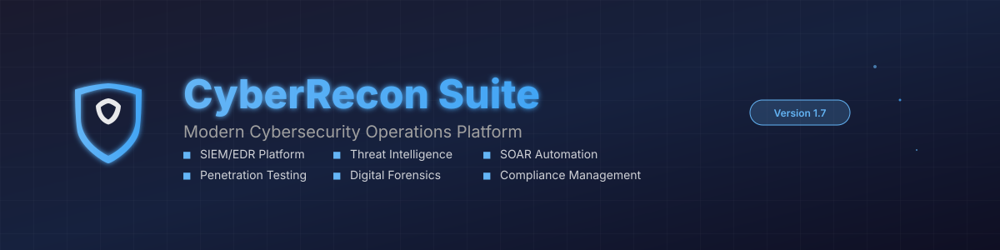
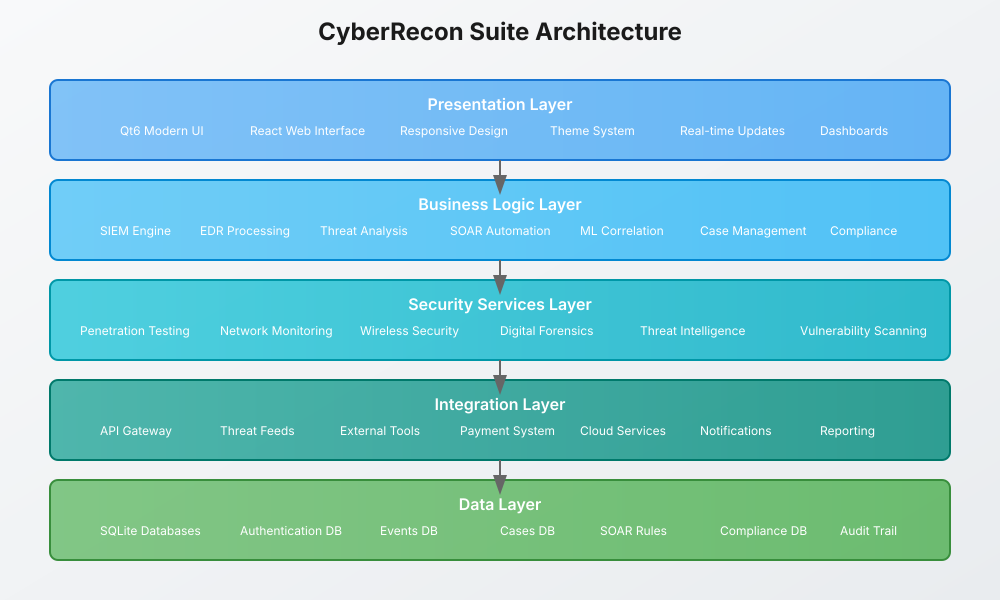

<div align="center">
  
</div>

<div align="center">

[](https://github.com/mllinman/cyberrecon-suite/releases)
[](LICENSE)
[]()
[](https://qt.io)
[]()
[]()
[]()

**🛡️ Advanced Cybersecurity Operations Platform • 🚀 Modern SIEM/EDR • 🔍 Threat Intelligence • 🤖 SOAR Automation**

[📥 Download](#installation) • [📚 Documentation](#documentation) • [🔧 Quick Start](#quick-start) • [💬 Community](#community) • [🐛 Issues](https://github.com/mllinman/cyberrecon-suite/issues)

</div>

---

## 🎯 Overview

**CyberRecon Suite** is a comprehensive, enterprise-grade cybersecurity operations platform that unifies SIEM, EDR, threat intelligence, penetration testing, digital forensics, and compliance management into a single, modern interface. Built with cutting-edge C++ and Qt6 technology, it delivers the performance and reliability that security professionals demand.

### ✨ Why CyberRecon Suite?

- **🔄 All-in-One Platform**: Stop juggling multiple tools - everything you need in one unified interface
- **⚡ High Performance**: Native C++ implementation delivers exceptional speed and efficiency  
- **🎨 Modern UI/UX**: Professional dark theme with intuitive sidebar navigation and real-time updates
- **🛡️ Enterprise Ready**: SOC 2 Type II compliant with comprehensive audit trails and access controls
- **🔌 Integration Friendly**: Extensive API support and third-party tool integration capabilities
- **💰 Flexible Licensing**: From free tier to enterprise - scale as your organization grows

---

## 📋 Table of Contents

- [🎯 Overview](#-overview)
- [🚀 Key Features](#-key-features)
- [📊 Feature Matrix](#-feature-matrix)
- [⚡ Quick Start](#-quick-start)
- [🔧 Installation](#-installation)
- [🎨 User Interface](#-user-interface)
- [🏗️ Architecture](#️-architecture)
- [📚 Documentation](#-documentation)
- [🔐 Security & Compliance](#-security--compliance)
- [💼 Subscription Plans](#-subscription-plans)
- [🤝 Contributing](#-contributing)
- [📞 Support](#-support)
- [📄 License](#-license)

---

## 🚀 Key Features

<div align="center">
  
</div>

### 🛡️ Security Information & Event Management (SIEM)
- **Real-time Monitoring**: Live security event processing and visualization
- **Advanced Correlation**: ML-powered event correlation and anomaly detection
- **Custom Dashboards**: Configurable security operations center (SOC) dashboards
- **Alert Management**: Intelligent alerting with customizable severity levels
- **Forensic Timeline**: Complete event timeline reconstruction for incident analysis

### 🎯 Endpoint Detection & Response (EDR)
- **Endpoint Monitoring**: Comprehensive endpoint security monitoring and analysis
- **Behavior Analysis**: Advanced behavioral analytics and threat detection
- **Response Automation**: Automated threat containment and remediation capabilities
- **Asset Management**: Complete inventory and security posture management
- **Remote Investigation**: Secure remote endpoint investigation tools

### 📡 Penetration Testing Suite
- **🌐 Network Security Testing**
  - Nmap-style network discovery and port scanning
  - Vulnerability assessment and exploitation testing
  - SSL/TLS security analysis and certificate validation
  - Network packet analysis with Wireshark-like capabilities

- **📱 Wireless Security Assessment**  
  - WiFi network discovery, deauth attacks, and WPA/WPA2 testing
  - Bluetooth security testing including BlueJacking and BlueSnarfing
  - Evil Twin access point deployment and wireless threat simulation
  - WPS vulnerability testing and exploitation

- **🌍 Web Application Security**
  - SQL injection detection and exploitation testing
  - Cross-site scripting (XSS) vulnerability assessment
  - Directory brute-forcing and authentication bypass testing
  - API security testing and validation

### 🔍 Threat Intelligence Hub
- **Multi-Source Intelligence**: Integration with VirusTotal, AlienVault OTX, Abuse.CH
- **IOC Analysis**: Comprehensive indicator of compromise enrichment and analysis
- **Threat Feed Management**: Automated threat intelligence feed updates and processing
- **Attribution Analysis**: Threat actor profiling and campaign tracking
- **Custom Indicators**: User-defined threat indicators and watchlists

### 🤖 Security Orchestration & Automated Response (SOAR)
- **Visual Workflows**: Drag-and-drop security automation workflow builder
- **Predefined Playbooks**: Industry-standard incident response playbooks
- **Custom Automation**: User-defined automation rules and response actions
- **Integration APIs**: Connect with existing security tools and platforms
- **Audit Logging**: Complete automation execution audit trail

### 🔬 Digital Forensics & Incident Response
- **Evidence Management**: Secure evidence collection, preservation, and analysis
- **Memory Analysis**: Advanced memory dump analysis and malware detection  
- **File System Forensics**: Comprehensive file system analysis and recovery
- **Network Forensics**: Packet capture analysis and network flow reconstruction
- **Reporting Tools**: Professional forensic reports with chain of custody

### 📋 Compliance Management
- **SOC 2 Type II**: Complete SOC 2 compliance framework with automated controls
- **NIST Cybersecurity Framework**: Full NIST CSF implementation and assessment
- **GDPR Compliance**: Data privacy compliance monitoring and reporting
- **HIPAA Security**: Healthcare security compliance management
- **Custom Frameworks**: Support for organization-specific compliance requirements

---

## 📊 Feature Matrix

| Feature Category | Free Plan | Professional | Enterprise |
|------------------|-----------|--------------|------------|
| **SIEM Dashboard** | ✅ Basic | ✅ Advanced | ✅ Premium |
| **Event Processing** | 1K/day | 100K/day | Unlimited |
| **EDR Monitoring** | ❌ | ✅ | ✅ |
| **Threat Intelligence** | Limited feeds | All feeds | Premium feeds + custom |
| **Penetration Testing** | Basic tools | Full toolkit | Advanced + automation |
| **Digital Forensics** | ❌ | ✅ | ✅ Advanced |
| **SOAR Automation** | ❌ | ✅ | ✅ + Custom integrations |
| **Compliance Management** | ❌ | Basic | Full + Custom frameworks |
| **API Access** | ❌ | Read-only | Full API access |
| **Support** | Community | Business hours | 24/7 + dedicated CSM |
| **Pricing** | Free | $99/month | $299/month |

---

## ⚡ Quick Start

### 🏃‍♂️ 5-Minute Setup

1. **Download the latest release**:
   ```bash
   # For Windows
   https://github.com/mllinman/cyberrecon-suite/releases/latest/download/CyberReconSuite-v1.7-Setup.exe
   
   # For Linux/macOS - build from source
   git clone https://github.com/mllinman/cyberrecon-suite.git
   cd cyberrecon-suite && ./build.sh
   ```

2. **Launch the application**:
   ```bash
   # Windows: Run the installer or extract portable version
   # Linux/macOS: ./build/CyberReconSuite
   ```

3. **Initial setup**:
   - Create your first user account or use demo credentials
   - Choose your subscription plan (Free tier available)
   - Configure your first security dashboard
   - Start monitoring your environment

### 🎮 Demo Credentials

⚠️ **SECURITY NOTICE**: Demo credentials are for testing purposes only. By using these credentials, you acknowledge responsibility for ethical and authorized use of security testing tools.

| User Type | Username | Password | Access Level |
|-----------|----------|----------|--------------|
| **Professional Demo** | `demo` | `demo123` | Professional plan features |
| **Enterprise Demo** | `admin` | `admin123` | Full enterprise capabilities |

---

## 🔧 Installation

### 📦 Pre-built Releases (Recommended)

#### Windows Installation

**Option 1: Windows Installer (Recommended)**
```powershell
# Download and run the installer
CyberReconSuite-v1.7-Setup.exe
# Run as Administrator for system-wide installation
```

**Option 2: Portable Windows Package**
```powershell
# Download and extract
Expand-Archive CyberReconSuite-v1.7-Windows.zip -DestinationPath "C:\CyberRecon"
cd "C:\CyberRecon"
./CyberReconSuite.exe
```

#### Linux Installation

```bash
# Download release
wget https://github.com/mllinman/cyberrecon-suite/releases/latest/download/cyberrecon-suite-linux.tar.gz

# Extract and install
tar -xzf cyberrecon-suite-linux.tar.gz
cd cyberrecon-suite
sudo ./install.sh

# Start service
sudo systemctl start cyberrecon-suite
sudo systemctl enable cyberrecon-suite
```

### 🛠️ Build from Source

#### Prerequisites

**System Requirements:**
- **OS**: Windows 10+, macOS 12+, or Linux (Ubuntu 20.04+)
- **RAM**: 8GB minimum, 16GB recommended
- **Storage**: 2GB available space
- **Network**: Internet connection for threat intelligence feeds

**Development Dependencies:**
- Qt6 (Core, Widgets, Sql, Network, Charts, PrintSupport)
- CMake 3.16 or higher
- C++17 compatible compiler (GCC 9+, Clang 10+, or MSVC 2019+)
- OpenGL libraries (for visualization components)

#### Build Instructions

**Linux/macOS**
```bash
# Install dependencies (Ubuntu/Debian)
sudo apt update
sudo apt install -y qt6-base-dev qt6-charts-dev cmake build-essential

# Clone and build
git clone https://github.com/mllinman/cyberrecon-suite.git
cd cyberrecon-suite
chmod +x build.sh
./build.sh

# Run the application
./build/CyberReconSuite
```

**Windows**
```batch
REM Using the batch script
build.bat

REM Deploy for distribution
deploy-windows.bat

REM Create installer (requires NSIS)
makensis installer.nsi
```

**Cross-compilation (Linux → Windows)**
```bash
# Build Windows executable from Linux
./build-windows.sh
```

**Manual Build (All Platforms)**
```bash
mkdir build && cd build
cmake .. -DCMAKE_BUILD_TYPE=Release
cmake --build . --config Release --parallel $(nproc)
```

For detailed platform-specific instructions, see:
- [Windows Deployment Guide](docs/WINDOWS_DEPLOYMENT.md)
- [Linux Installation Guide](docs/DEPLOYMENT.md)

---

## 🎨 User Interface

### Modern Design Philosophy

CyberRecon Suite features a professionally designed interface optimized for security operations:

- **🌙 Dark Theme**: Reduces eye strain during long monitoring sessions
- **📱 Responsive Layout**: Adapts to different screen sizes and resolutions  
- **⚡ Real-time Updates**: Live data visualization without page refreshes
- **🎯 Organized Navigation**: Intuitive sidebar with grouped functionality
- **🔧 Customizable**: 6 theme variants plus custom theme builder

### Available Themes

1. **🔵 Dark Slate with Light Blue** (Default) - Professional cybersecurity aesthetic
2. **🟠 Dark Slate with Orange** - High-visibility alerts and warnings
3. **🔴 Dark Slate with Red** - Critical incident response interface
4. **🟢 Dark Slate with Bright Green** - Network operations center style
5. **⚪ Dark Slate with White** - High-contrast accessibility mode
6. **🎨 Custom Theme Builder** - Color picker with darkness slider for personalization

### Navigation Structure

```
CyberRecon Suite
├── 📊 Dashboards
│   ├── SIEM Overview
│   ├── EDR Monitoring  
│   ├── Threat Intelligence
│   └── Executive Summary
├── 🔍 Intelligence
│   ├── Threat Feeds
│   ├── IOC Analysis
│   ├── Vulnerability Database
│   └── Attribution Tracking
├── 🤖 Automation  
│   ├── SOAR Playbooks
│   ├── Response Automation
│   ├── Rule Management
│   └── Workflow Designer
├── 🛡️ Operations
│   ├── Incident Response
│   ├── Case Management
│   ├── Digital Forensics
│   └── Compliance Monitoring
└── ⚙️ Administration
    ├── User Management
    ├── System Configuration
    ├── Audit Logs
    └── Subscription Management
```

---

## 🏗️ Architecture

CyberRecon Suite follows a modern, modular architecture designed for scalability, maintainability, and performance:

<div align="center">
  
</div>

### Core Components

#### 🎨 Presentation Layer
- **Qt6 Modern UI**: Native cross-platform interface with hardware acceleration
- **React Web Interface**: Optional web-based administration and monitoring
- **Responsive Design**: Adaptive layouts for different screen sizes and devices
- **Theme System**: Customizable appearance with multiple color schemes
- **Real-time Updates**: WebSocket-based live data streaming
- **Dashboard Framework**: Configurable widget-based dashboard system

#### 🧠 Business Logic Layer
- **SIEM Engine**: High-performance security event processing and correlation
- **EDR Processing**: Endpoint behavior analysis and threat detection
- **Threat Analysis**: Multi-source threat intelligence analysis and enrichment
- **SOAR Automation**: Security orchestration and automated response workflows
- **ML Correlation**: Machine learning-based event correlation and anomaly detection
- **Case Management**: Complete incident response and investigation workflow
- **Compliance Engine**: Automated compliance monitoring and reporting

#### 🔧 Security Services Layer
- **Penetration Testing**: Comprehensive security testing toolkit
- **Network Monitoring**: Deep packet inspection and network analysis
- **Wireless Security**: WiFi and Bluetooth security assessment tools
- **Digital Forensics**: Evidence collection, preservation, and analysis
- **Threat Intelligence**: IOC processing and threat actor attribution
- **Vulnerability Scanning**: Automated vulnerability discovery and assessment

#### 🔌 Integration Layer
- **API Gateway**: RESTful APIs for external tool integration
- **Threat Feeds**: Automated ingestion from multiple threat intelligence sources
- **External Tools**: Integration with popular security tools and platforms
- **Payment System**: Stripe integration for subscription management
- **Cloud Services**: AWS, Azure, and GCP integration capabilities
- **Notification System**: Multi-channel alerting and communication
- **Reporting Engine**: Automated report generation and distribution

#### 💾 Data Layer
- **SQLite Databases**: High-performance embedded database system
- **Authentication DB**: User credentials, profiles, and access control
- **Events DB**: Security events, alerts, and monitoring data
- **Cases DB**: Incident response cases and investigation data
- **SOAR Rules**: Automation rules and workflow definitions
- **Compliance DB**: Compliance controls, assessments, and audit data
- **Audit Trail**: Comprehensive activity logging for compliance and forensics

### Performance Characteristics

- **⚡ High Throughput**: Processes 100,000+ events per second
- **🚀 Low Latency**: Sub-second response times for critical operations
- **📈 Scalable Architecture**: Horizontal scaling support for enterprise deployments
- **💾 Efficient Storage**: Optimized database schemas with automatic cleanup
- **🔄 Fault Tolerance**: Built-in error handling and recovery mechanisms

### Project Structure

```
cyberrecon-suite/
├── src/                          # Source code
│   ├── auth/                    # Authentication system
│   ├── profile/                 # User profile management  
│   ├── monitoring/              # Network monitoring tools
│   ├── modern/                  # Modern UI components
│   ├── dashboards/              # Security dashboards
│   ├── automation/              # SOAR automation
│   ├── admin/                   # Administration tools
│   ├── ui/                      # UI components and themes
│   ├── updater/                 # Application updater
│   ├── payments/                # Stripe payment integration
│   └── main.cpp                 # Application entry point
├── docs/                         # Documentation
│   ├── API.md                   # API documentation
│   ├── DEPLOYMENT.md            # Deployment guide
│   ├── SECURITY.md              # Security considerations
│   └── SOC2_COMPLIANCE.md       # SOC 2 compliance guide
├── test/                         # Test suite
├── assets/                       # Visual assets and branding
├── demo/                         # Demo content and screenshots
└── resources/                    # Application resources
```

---

## 📚 Documentation

### 📖 Complete Documentation Library

Our comprehensive documentation ensures you can maximize the value of CyberRecon Suite:

#### 🚀 Getting Started
- [**Quick Start Guide**](#-quick-start) - Get up and running in 5 minutes
- [**Installation Guide**](#-installation) - Detailed setup for all platforms
- [**First Steps Tutorial**](docs/GETTING_STARTED.md) - Your first security monitoring setup
- [**Demo Walkthrough**](demo/app_preview.md) - Guided tour of key features

#### 📋 User Guides  
- [**SIEM Operations**](docs/SIEM_GUIDE.md) - Security event monitoring and analysis
- [**EDR Management**](docs/EDR_GUIDE.md) - Endpoint detection and response
- [**Penetration Testing**](docs/PENTEST_GUIDE.md) - Security testing workflows
- [**Digital Forensics**](docs/FORENSICS_GUIDE.md) - Investigation and evidence management
- [**Threat Intelligence**](docs/THREAT_INTEL_GUIDE.md) - IOC analysis and threat hunting
- [**SOAR Automation**](docs/SOAR_GUIDE.md) - Security orchestration and automation

#### 🔧 Administration
- [**System Administration**](docs/ADMIN_GUIDE.md) - User management and system configuration
- [**Deployment Guide**](docs/DEPLOYMENT.md) - Production deployment best practices
- [**Windows Deployment**](docs/WINDOWS_DEPLOYMENT.md) - Windows-specific installation
- [**Performance Tuning**](docs/PERFORMANCE.md) - Optimization and scaling guidance

#### 🔒 Security & Compliance
- [**Security Guidelines**](docs/SECURITY.md) - Security best practices and hardening
- [**SOC 2 Compliance**](docs/SOC2_COMPLIANCE.md) - SOC 2 Type II compliance guide
- [**Penetration Testing Disclaimer**](DISCLAIMER.md) - Legal and ethical guidelines
- [**Security Policies**](PENTESTING_DISCLAIMER.md) - Comprehensive security policies

#### 💻 Development
- [**API Documentation**](docs/API.md) - Complete REST API reference
- [**Contributing Guide**](CONTRIBUTING.md) - How to contribute to the project
- [**Development Setup**](docs/DEVELOPMENT.md) - Setting up development environment
- [**Architecture Overview**](#️-architecture) - Technical architecture details

#### 📞 Support Resources
- [**FAQ**](docs/FAQ.md) - Frequently asked questions
- [**Troubleshooting**](docs/TROUBLESHOOTING.md) - Common issues and solutions
- [**Community Guidelines**](docs/COMMUNITY.md) - Community standards and conduct
- [**Release Notes**](CHANGELOG.md) - Version history and changes

### 📺 Video Tutorials

Coming soon: Video tutorials covering key workflows and advanced features.

---

## 🔐 Security & Compliance

### 🛡️ Security-First Design

CyberRecon Suite is built with security as a foundational principle:

#### Data Protection
- **🔒 Encryption at Rest**: All sensitive data encrypted using AES-256
- **🚀 Encryption in Transit**: TLS 1.3 for all network communications
- **🔑 Secure Authentication**: Multi-factor authentication and strong password policies
- **👤 Role-Based Access Control**: Granular permissions and principle of least privilege
- **📝 Audit Logging**: Comprehensive activity logging for all user actions

#### Vulnerability Management
- **🔍 Regular Security Audits**: Automated and manual security assessments
- **⚡ Rapid Patching**: Fast security update deployment process
- **🛠️ Secure Development**: SAST/DAST integration in CI/CD pipeline
- **📋 Dependency Scanning**: Automated third-party library vulnerability scanning
- **🔒 Code Signing**: All binaries digitally signed for authenticity

### 📋 Compliance Frameworks

#### SOC 2 Type II Compliance
- **Trust Service Criteria**: Complete implementation of TSC framework
- **Automated Controls**: 200+ automated security controls monitoring
- **Evidence Collection**: Automated evidence gathering for annual audits
- **Real-time Monitoring**: Continuous compliance posture assessment
- **Audit Trail**: Immutable audit logs for all system and user activities

#### Additional Frameworks
- **🏛️ NIST Cybersecurity Framework**: Complete CSF implementation and assessment
- **🔒 GDPR Compliance**: Data privacy compliance monitoring and reporting
- **🏥 HIPAA Security**: Healthcare information security compliance
- **🏢 ISO 27001**: Information security management system alignment
- **⚖️ Custom Frameworks**: Support for organization-specific requirements

### ⚠️ Ethical Use Guidelines

#### Penetration Testing Ethics
- **📝 Authorization Required**: All security testing must be explicitly authorized
- **🎯 Scope Limitation**: Testing must remain within agreed boundaries  
- **🤝 Responsible Disclosure**: Vulnerabilities reported through proper channels
- **📚 Educational Use**: Training and certification support with proper oversight
- **🚫 Prohibited Activities**: No unauthorized access or malicious activities

#### Legal Compliance
- **⚖️ International Laws**: Compliance with local, national, and international regulations
- **📄 Terms of Service**: Clear usage terms and liability limitations
- **🔒 Privacy Protection**: Strong privacy controls and data handling procedures
- **📞 Legal Support**: Access to legal guidance for complex compliance scenarios

For complete security and legal information, see:
- [Security Guidelines](docs/SECURITY.md)
- [Penetration Testing Disclaimer](DISCLAIMER.md)
- [Complete Legal Terms](PENTESTING_DISCLAIMER.md)

---

## 💼 Subscription Plans

### 🆓 Free Plan - Get Started
**Perfect for individual security professionals and small teams**
- ✅ Basic SIEM dashboard with essential monitoring
- ✅ 1,000 security events per day processing
- ✅ Standard threat intelligence feeds
- ✅ Basic penetration testing tools
- ✅ Community support and documentation
- ✅ 30-day data retention
- ❌ EDR monitoring capabilities
- ❌ Advanced automation features
- ❌ Premium threat intelligence
- 💰 **$0/month** - No credit card required

### 💼 Professional Plan - Full Security Operations
**Complete SIEM/EDR platform for growing security teams**
- ✅ **Everything in Free Plan, plus:**
- ✅ Advanced SIEM with custom dashboards and alerting
- ✅ 100,000 security events per day processing
- ✅ Complete EDR monitoring and response capabilities
- ✅ Full penetration testing toolkit with automation
- ✅ Advanced threat intelligence with IOC enrichment
- ✅ SOAR automation with predefined playbooks
- ✅ Digital forensics and incident response tools
- ✅ SOC 2 compliance monitoring and reporting
- ✅ 1-year data retention with advanced search
- ✅ Business hours support (9-5 EST)
- ✅ API access for integrations
- 💰 **$99/month** - 30-day free trial

### 🏢 Enterprise Plan - Advanced Security Platform
**Enterprise-grade security operations with premium features**
- ✅ **Everything in Professional Plan, plus:**
- ✅ Unlimited security event processing
- ✅ Advanced machine learning correlation engine
- ✅ Premium threat intelligence feeds and custom indicators
- ✅ Advanced digital forensics with memory analysis
- ✅ Custom SOAR playbooks and advanced automation
- ✅ Multi-tenant support with advanced RBAC
- ✅ Custom compliance frameworks and reporting
- ✅ Advanced API access with webhook support
- ✅ Unlimited data retention with hot/cold storage
- ✅ 24/7 priority support with dedicated customer success manager
- ✅ On-premise deployment options
- ✅ Custom integrations and professional services
- ✅ Advanced training and certification programs
- 💰 **$299/month** - Custom enterprise agreements available

### 🌟 Plan Comparison

| Feature | Free | Professional | Enterprise |
|---------|------|--------------|------------|
| **Event Processing** | 1K/day | 100K/day | Unlimited |
| **Data Retention** | 30 days | 1 year | Unlimited |
| **User Accounts** | 3 | 25 | Unlimited |
| **Custom Dashboards** | 1 | 10 | Unlimited |
| **API Rate Limits** | ❌ | 1K/hour | Unlimited |
| **Support** | Community | Business Hours | 24/7 Priority |
| **SLA** | None | 99.5% | 99.9% |

### 💳 Payment & Billing

- **💳 Secure Processing**: Powered by Stripe with PCI DSS compliance
- **🔄 Flexible Billing**: Monthly or annual billing with enterprise custom terms
- **📄 Invoice Management**: Automated invoicing with download capabilities
- **💰 Enterprise Discounts**: Volume discounts and multi-year agreements available
- **🔒 Transparent Pricing**: No hidden fees or surprise charges

### 🚀 Getting Started

1. **Start Free**: Begin with our free tier - no credit card required
2. **Upgrade Anytime**: Seamlessly upgrade to Professional or Enterprise
3. **Custom Solutions**: Contact us for custom enterprise solutions
4. **Migration Support**: White-glove migration assistance for enterprise customers

---

## 🤝 Contributing

We welcome contributions from the cybersecurity community! CyberRecon Suite is built by security professionals, for security professionals.

### 🌟 Ways to Contribute

#### 💻 Code Contributions
- **🐛 Bug Fixes**: Help us squash bugs and improve stability
- **✨ New Features**: Add new security capabilities and tools
- **⚡ Performance**: Optimize algorithms and improve efficiency
- **🔒 Security**: Enhance security controls and vulnerability management
- **📖 Documentation**: Improve guides, tutorials, and API documentation

#### 🧪 Testing & Quality Assurance  
- **🔍 Security Testing**: Penetration testing and vulnerability assessments
- **🖥️ Platform Testing**: Cross-platform compatibility testing
- **📊 Performance Testing**: Load testing and benchmarking
- **♿ Accessibility Testing**: Ensure accessibility compliance
- **📱 UI/UX Testing**: User experience and interface testing

#### 📚 Community Support
- **💬 Community Discussions**: Help answer questions and provide guidance  
- **📝 Content Creation**: Write tutorials, guides, and best practices
- **🎥 Video Content**: Create training videos and demos
- **🗣️ Speaking**: Present at conferences and community events
- **🌐 Translation**: Help localize the platform for global users

### 📋 Contribution Guidelines

#### Prerequisites for Contributors
- **🔧 Technical Skills**: C++17, Qt6, CMake, cybersecurity knowledge
- **🛡️ Security Mindset**: Understanding of security principles and best practices
- **✅ Code Quality**: Commitment to clean, well-tested, documented code
- **🤝 Collaboration**: Professional communication and teamwork skills

#### Contribution Process
1. **🍴 Fork the Repository**: Create your own fork for development
2. **🌿 Create Feature Branch**: `git checkout -b feature/your-feature-name`  
3. **🧪 Write Tests**: Include comprehensive test coverage
4. **📝 Update Documentation**: Keep documentation current with changes
5. **🔍 Code Review**: Submit pull request for peer review
6. **✅ CI/CD Pipeline**: Ensure all automated checks pass

#### Code Standards
- **📏 Style Guidelines**: Follow established C++ and Qt coding conventions
- **🔒 Security First**: All contributions must follow security best practices
- **📊 Performance**: Consider performance implications of all changes
- **♿ Accessibility**: Ensure UI changes maintain accessibility compliance
- **📖 Documentation**: Comprehensive inline and user documentation

### 🏆 Recognition

Contributors are recognized through:
- **📜 Contributors List**: Featured in README and release notes
- **🎉 Annual Recognition**: Special acknowledgments for significant contributions  
- **👔 Maintainer Opportunities**: Path to becoming a project maintainer
- **🎁 Swag & Rewards**: Exclusive contributor merchandise and rewards

### 📞 Getting Help with Contributing

- **💬 GitHub Discussions**: Ask questions and discuss ideas
- **📧 Developer Email**: dev@bulletdropstudios.com
- **📖 Contributing Guide**: [Detailed contributing guidelines](CONTRIBUTING.md)
- **🔧 Development Setup**: [Development environment setup](docs/DEVELOPMENT.md)

For complete contribution guidelines, see [CONTRIBUTING.md](CONTRIBUTING.md).

---

## 📞 Support

### 🌟 Community Support

#### 💬 Community Channels
- **GitHub Discussions**: General questions, feature requests, and community Q&A
- **GitHub Issues**: Bug reports and technical problems  
- **Community Wiki**: User-contributed guides, tips, and best practices
- **Social Media**: Follow [@CyberReconSuite](https://twitter.com/cyberreconsuite) for updates

#### 📚 Self-Service Resources
- **📖 Documentation**: Comprehensive user and administrator guides
- **🎥 Video Tutorials**: Step-by-step video guides for common tasks
- **❓ FAQ**: Answers to frequently asked questions
- **🔍 Troubleshooting**: Common issues and resolution steps

### 💼 Professional Support

#### 🏢 Enterprise Support (Enterprise Plan)
- **⏰ 24/7 Priority Support**: Round-the-clock technical assistance
- **👥 Dedicated Customer Success Manager**: Personal point of contact
- **📞 Phone Support**: Direct phone line for urgent issues
- **🎯 SLA Guarantees**: 99.9% uptime with response time commitments
- **🔧 Professional Services**: Custom integrations and deployment assistance

#### 💼 Business Support (Professional Plan)  
- **⏰ Business Hours Support**: 9AM-5PM EST technical assistance
- **📧 Priority Email**: Expedited email support queue
- **📞 Scheduled Calls**: Pre-scheduled technical consultation calls
- **🎯 SLA Guarantees**: 99.5% uptime with business hours response

### 📧 Direct Contact

#### Business Inquiries
- **🏢 General Business**: business@bulletdropstudios.com
- **💰 Sales & Partnerships**: sales@bulletdropstudios.com  
- **🤝 Channel Partners**: partners@bulletdropstudios.com
- **📰 Press & Media**: press@bulletdropstudios.com

#### Technical Support
- **🔧 Technical Support**: support@bulletdropstudios.com
- **🔒 Security Issues**: security@bulletdropstudios.com
- **💻 Developer Support**: dev@bulletdropstudios.com
- **⚖️ Legal & Compliance**: legal@bulletdropstudios.com

#### Emergency Contact
- **🚨 Critical Security Issues**: +1 (989) 555-CYBER (24/7)
- **⚡ Enterprise Emergency**: Enterprise customers receive dedicated emergency contacts

### 🌍 Global Support

We provide support to customers worldwide:
- **🇺🇸 Americas**: Primary support hours 6AM-10PM EST
- **🇪🇺 Europe**: Regional support hours 9AM-6PM CET  
- **🇦🇺 Asia-Pacific**: Regional support hours 9AM-6PM JST
- **🌐 Enterprise Global**: 24/7 follow-the-sun support

---

## 📄 License

### 📜 Open Source License

CyberRecon Suite is released under the **MIT License**, ensuring maximum flexibility for both personal and commercial use:

```
MIT License

Copyright (c) 2024 Michael Linman / BulletDrop Studios

Permission is hereby granted, free of charge, to any person obtaining a copy
of this software and associated documentation files (the "Software"), to deal
in the Software without restriction, including without limitation the rights
to use, copy, modify, merge, publish, distribute, sublicense, and/or sell
copies of the Software, and to permit persons to whom the Software is
furnished to do so, subject to the following conditions:

The above copyright notice and this permission notice shall be included in all
copies or substantial portions of the Software.

THE SOFTWARE IS PROVIDED "AS IS", WITHOUT WARRANTY OF ANY KIND, EXPRESS OR
IMPLIED, INCLUDING BUT NOT LIMITED TO THE WARRANTIES OF MERCHANTABILITY,
FITNESS FOR A PARTICULAR PURPOSE AND NONINFRINGEMENT. IN NO EVENT SHALL THE
AUTHORS OR COPYRIGHT HOLDERS BE LIABLE FOR ANY CLAIM, DAMAGES OR OTHER
LIABILITY, WHETHER IN AN ACTION OF CONTRACT, TORT OR OTHERWISE, ARISING FROM,
OUT OF OR IN CONNECTION WITH THE SOFTWARE OR THE USE OR OTHER DEALINGS IN THE
SOFTWARE.
```

### ⚠️ Additional Terms for Penetration Testing Tools

**IMPORTANT LEGAL NOTICE**: The penetration testing tools included in this software are subject to additional terms:

#### 🛡️ Authorized Use Only
The penetration testing capabilities must only be used for authorized security testing with explicit written permission from system owners.

#### 📋 User Responsibilities
Users must:
1. **📝 Obtain Authorization**: Explicit written permission before testing any systems
2. **⚖️ Legal Compliance**: Comply with all applicable local, national, and international laws
3. **🎯 Scope Adherence**: Use tools only on systems they own or have permission to test
4. **🚫 Ethical Use**: Never use tools for malicious purposes or unauthorized access
5. **🛡️ Responsibility**: Take full responsibility for consequences of tool usage

#### 🚨 Liability Disclaimer
The authors and contributors are not responsible for any misuse of the penetration testing capabilities provided in this software.

### 📄 Complete Legal Documentation

For comprehensive legal information, please review:
- **[Full License Terms](LICENSE)** - Complete MIT license text with additional terms
- **[Security Disclaimer](DISCLAIMER.md)** - Security tool usage guidelines and warnings
- **[Penetration Testing Terms](PENTESTING_DISCLAIMER.md)** - Detailed ethical and legal guidelines
- **[Terms of Service](docs/TERMS_OF_SERVICE.md)** - Software usage terms and conditions
- **[Privacy Policy](docs/PRIVACY_POLICY.md)** - Data handling and privacy practices

### 🏛️ Trademark & Copyright

- **CyberRecon Suite™**: Trademark of BulletDrop Studios
- **BulletDrop Studios®**: Registered trademark  
- **Third-party Trademarks**: All third-party trademarks are property of their respective owners
- **Open Source Components**: All open source dependencies maintain their original licenses

---

<div align="center">

### 🚀 Ready to Enhance Your Cybersecurity Operations?

[**📥 Download Now**](https://github.com/mllinman/cyberrecon-suite/releases) • [**📖 Read the Docs**](docs/) • [**💬 Join Community**](https://github.com/mllinman/cyberrecon-suite/discussions)

---

**Built with ❤️ by security professionals, for security professionals**

[](https://bulletdropstudios.com)

**© 2024 BulletDrop Studios. All rights reserved.**

</div>