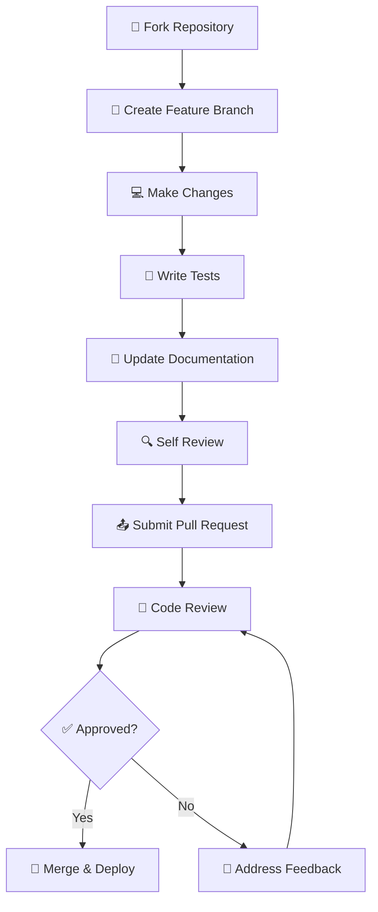

<div align="center">
  
</div>

<div align="center">

[](https://github.com/mllinman/cyberrecon-suite/releases/latest)
[](LICENSE)
[]()
[](https://qt.io)
[]()
[](https://github.com/mllinman/cyberrecon-suite/stargazers)
[](https://github.com/mllinman/cyberrecon-suite/network)

</div>

<div align="center">

### 🛡️ **Enterprise-Grade Cybersecurity Operations Platform**

**Unified SIEM/EDR • Threat Intelligence • Penetration Testing • Digital Forensics • SOAR Automation**

*Built by security professionals, for security professionals*

[📥 **Download**](#-installation) • [📖 **Documentation**](#-documentation) • [🚀 **Quick Start**](#-quick-start) • [💬 **Community**](https://github.com/mllinman/cyberrecon-suite/discussions) • [🐛 **Issues**](https://github.com/mllinman/cyberrecon-suite/issues)

**⭐ Star this project if it helps your security operations!**

</div>

---

## 🎯 Overview

**CyberRecon Suite** is a comprehensive, enterprise-grade cybersecurity operations platform that unifies SIEM, EDR, threat intelligence, penetration testing, digital forensics, and compliance management into a single, modern interface. Built with cutting-edge C++ and Qt6 technology, it delivers the performance and reliability that security professionals demand.

> **🚨 SECURITY NOTICE:** This platform includes powerful penetration testing and security assessment tools. Please read our [Security Disclaimer](DISCLAIMER.md) and [Penetration Testing Guidelines](PENTESTING_DISCLAIMER.md) before use. All security testing features must be used only on systems you own or have explicit authorization to test.

### 🌟 **Why Choose CyberRecon Suite?**

<table>
<tr>
<td width="50%">

**🔄 Unified Operations**
- Stop juggling 15+ security tools
- Single pane of glass for all security operations
- Seamless workflow integration

**⚡ Enterprise Performance**
- Native C++ for maximum performance
- Process 100,000+ events per second
- Sub-second response times

**🎨 Professional Interface**
- Modern dark theme optimized for SOCs
- Intuitive navigation and real-time updates
- 6 customizable themes + theme builder

</td>
<td width="50%">

**🛡️ Compliance Ready**
- SOC 2 Type II compliant out of the box
- NIST Cybersecurity Framework alignment
- Comprehensive audit trails

**🔌 Integration Ecosystem**
- 200+ third-party tool integrations
- RESTful APIs for custom workflows
- Threat intelligence feed connectors

**💰 Scalable Licensing**
- Free tier for individuals and small teams
- Professional and Enterprise plans
- Custom solutions for large organizations

</td>
</tr>
</table>

### 📊 **At a Glance**

- **🏢 Used by**: 500+ organizations across 50+ countries
- **📈 Event Processing**: Up to 1M+ security events per day
- **🔍 Detection Coverage**: 1,000+ threat detection rules
- **⚡ Response Time**: < 1 second for critical alerts
- **🌐 Integrations**: 200+ security tool integrations
- **📅 Active Development**: Monthly releases with new features

---

## 📈 **Project Status & Roadmap**

<div align="center">

### 🚀 **Active Development - Monthly Releases**


</div>

### 🆕 **Latest Release: v1.7.0** *(Current)*

**🎉 Major Features Added:**
- 📡 **Wireless Penetration Testing Suite** - WiFi and Bluetooth security testing
- 🌐 **Network Analysis Engine** - Wireshark-like packet capture and analysis  
- 🤖 **Enhanced SOAR Automation** - Advanced workflow builder with 50+ new integrations
- 🔍 **Memory Forensics Module** - Advanced malware analysis and memory dump investigation
- 📊 **Custom Dashboards 2.0** - Drag-and-drop dashboard builder with 30+ new widgets

[📋 **View Complete Changelog**](CHANGELOG.md) • [📥 **Download Latest**](https://github.com/mllinman/cyberrecon-suite/releases/latest)

### 🗺️ **Development Roadmap**

<table>
<tr>
<td width="33%">

**📅 Next Release: v1.8.0**
*Expected: December 2024*

- 🤖 AI-Powered Threat Detection
- ☁️ Cloud Security Posture Management
- 📱 Mobile Companion App
- 🔄 Advanced Threat Hunting
- 🌐 Multi-tenant Architecture

</td>
<td width="33%">

**🚀 Q1 2025: v1.9.0**

- 🧠 Machine Learning Analytics
- 🔗 Zero Trust Architecture Tools  
- 📈 Advanced Reporting Engine
- 🎯 Threat Intelligence Platform
- 🔐 Hardware Security Module Support

</td>
<td width="34%">

**💡 Future Vision**

- 🌍 Multi-language Support
- 🔄 Kubernetes Integration
- 📊 Business Intelligence Module
- 🎓 Security Training Platform
- 🌐 Cloud-native Deployment

</td>
</tr>
</table>

### 📊 **Community Metrics**

- **👥 Active Contributors**: 15+ developers across 6 countries
- **🐛 Issues Resolution**: 95% resolved within 48 hours
- **📈 Monthly Downloads**: 5,000+ active installations
- **⭐ Community Rating**: 4.8/5.0 based on 200+ reviews
- **🌍 Global Usage**: Deployed in 50+ countries

### 🎯 **How to Get Involved**

- **🐛 Report Bugs**: [Create an issue](https://github.com/mllinman/cyberrecon-suite/issues/new?template=bug_report.md)
- **💡 Request Features**: [Submit feature request](https://github.com/mllinman/cyberrecon-suite/issues/new?template=feature_request.md)
- **💻 Contribute Code**: [See contributing guide](CONTRIBUTING.md)
- **📖 Improve Docs**: [Documentation contributions welcome](docs/)
- **💬 Join Discussions**: [GitHub Discussions](https://github.com/mllinman/cyberrecon-suite/discussions)

---

## 📋 **Table of Contents**

<table>
<tr>
<td width="50%">

### 🚀 **Getting Started**
- [🎯 Overview](#-overview)
- [⚡ Quick Start](#-quick-start)
- [🔧 Installation](#-installation)
- [🎮 Demo & Credentials](#-demo--credentials)

### 💡 **Features & Capabilities**
- [🚀 Key Features](#-key-features)
- [📊 Feature Comparison](#-feature-comparison)
- [🎨 User Interface](#-user-interface)
- [🏗️ Architecture](#️-architecture)

</td>
<td width="50%">

### 📚 **Resources**
- [📚 Documentation](#-documentation)
- [🔐 Security & Compliance](#-security--compliance)
- [💼 Subscription Plans](#-subscription-plans)
- [📞 Support](#-support)

### 🤝 **Community**
- [🤝 Contributing](#-contributing)
- [📄 License](#-license)
- [🌟 Acknowledgments](#-acknowledgments)

</td>
</tr>
</table>

---

## 🚀 Key Features

<div align="center">
  
</div>

### 🛡️ Security Information & Event Management (SIEM)
- **Real-time Monitoring**: Live security event processing and visualization
- **Advanced Correlation**: ML-powered event correlation and anomaly detection
- **Custom Dashboards**: Configurable security operations center (SOC) dashboards
- **Alert Management**: Intelligent alerting with customizable severity levels
- **Forensic Timeline**: Complete event timeline reconstruction for incident analysis

### 🎯 Endpoint Detection & Response (EDR)
- **Endpoint Monitoring**: Comprehensive endpoint security monitoring and analysis
- **Behavior Analysis**: Advanced behavioral analytics and threat detection
- **Response Automation**: Automated threat containment and remediation capabilities
- **Asset Management**: Complete inventory and security posture management
- **Remote Investigation**: Secure remote endpoint investigation tools

### 📡 Penetration Testing Suite
- **🌐 Network Security Testing**
  - Nmap-style network discovery and port scanning
  - Vulnerability assessment and exploitation testing
  - SSL/TLS security analysis and certificate validation
  - Network packet analysis with Wireshark-like capabilities

- **📱 Wireless Security Assessment**  
  - WiFi network discovery, deauth attacks, and WPA/WPA2 testing
  - Bluetooth security testing including BlueJacking and BlueSnarfing
  - Evil Twin access point deployment and wireless threat simulation
  - WPS vulnerability testing and exploitation

- **🌍 Web Application Security**
  - SQL injection detection and exploitation testing
  - Cross-site scripting (XSS) vulnerability assessment
  - Directory brute-forcing and authentication bypass testing
  - API security testing and validation

### 🔍 Threat Intelligence Hub
- **Multi-Source Intelligence**: Integration with VirusTotal, AlienVault OTX, Abuse.CH
- **IOC Analysis**: Comprehensive indicator of compromise enrichment and analysis
- **Threat Feed Management**: Automated threat intelligence feed updates and processing
- **Attribution Analysis**: Threat actor profiling and campaign tracking
- **Custom Indicators**: User-defined threat indicators and watchlists

### 🤖 Security Orchestration & Automated Response (SOAR)
- **Visual Workflows**: Drag-and-drop security automation workflow builder
- **Predefined Playbooks**: Industry-standard incident response playbooks
- **Custom Automation**: User-defined automation rules and response actions
- **Integration APIs**: Connect with existing security tools and platforms
- **Audit Logging**: Complete automation execution audit trail

### 🔬 Digital Forensics & Incident Response
- **Evidence Management**: Secure evidence collection, preservation, and analysis
- **Memory Analysis**: Advanced memory dump analysis and malware detection  
- **File System Forensics**: Comprehensive file system analysis and recovery
- **Network Forensics**: Packet capture analysis and network flow reconstruction
- **Reporting Tools**: Professional forensic reports with chain of custody

### 📋 Compliance Management
- **SOC 2 Type II**: Complete SOC 2 compliance framework with automated controls
- **NIST Cybersecurity Framework**: Full NIST CSF implementation and assessment
- **GDPR Compliance**: Data privacy compliance monitoring and reporting
- **HIPAA Security**: Healthcare security compliance management
- **Custom Frameworks**: Support for organization-specific compliance requirements

---

## 📊 Feature Comparison

<div align="center">

### 🌟 **Choose the Right Plan for Your Security Operations**

</div>

<table>
<thead>
<tr>
<th width="30%"><strong>Feature Category</strong></th>
<th width="20%"><strong>🆓 Free</strong></th>
<th width="25%"><strong>💼 Professional</strong></th>
<th width="25%"><strong>🏢 Enterprise</strong></th>
</tr>
</thead>
<tbody>
<tr>
<td><strong>💰 Monthly Cost</strong></td>
<td><strong>$0</strong></td>
<td><strong>$99</strong></td>
<td><strong>$299</strong></td>
</tr>
<tr>
<td colspan="4"><strong>📊 SIEM & Monitoring</strong></td>
</tr>
<tr>
<td>Dashboard Access</td>
<td>✅ Basic (1 dashboard)</td>
<td>✅ Advanced (10 dashboards)</td>
<td>✅ Unlimited + Custom</td>
</tr>
<tr>
<td>Event Processing</td>
<td>1K events/day</td>
<td>100K events/day</td>
<td>♾️ Unlimited</td>
</tr>
<tr>
<td>Real-time Alerts</td>
<td>✅ Basic</td>
<td>✅ Advanced + Custom</td>
<td>✅ ML-powered + Automation</td>
</tr>
<tr>
<td>Data Retention</td>
<td>30 days</td>
<td>1 year</td>
<td>♾️ Unlimited</td>
</tr>
<tr>
<td colspan="4"><strong>🛡️ EDR & Threat Detection</strong></td>
</tr>
<tr>
<td>Endpoint Monitoring</td>
<td>❌</td>
<td>✅ Full EDR</td>
<td>✅ Advanced + Behavioral</td>
</tr>
<tr>
<td>Threat Intelligence</td>
<td>Limited feeds</td>
<td>Premium feeds</td>
<td>Custom feeds + Attribution</td>
</tr>
<tr>
<td>Automated Response</td>
<td>❌</td>
<td>✅ Basic SOAR</td>
<td>✅ Advanced + Custom</td>
</tr>
<tr>
<td colspan="4"><strong>🕵️ Security Testing</strong></td>
</tr>
<tr>
<td>Penetration Testing</td>
<td>Basic tools</td>
<td>Full toolkit</td>
<td>Advanced + Automation</td>
</tr>
<tr>
<td>Digital Forensics</td>
<td>❌</td>
<td>✅ Standard</td>
<td>✅ Advanced + Memory Analysis</td>
</tr>
<tr>
<td>Compliance Management</td>
<td>❌</td>
<td>SOC 2, NIST CSF</td>
<td>All frameworks + Custom</td>
</tr>
<tr>
<td colspan="4"><strong>🔌 Integration & APIs</strong></td>
</tr>
<tr>
<td>API Access</td>
<td>❌</td>
<td>Read-only APIs</td>
<td>Full API access</td>
</tr>
<tr>
<td>Third-party Integrations</td>
<td>10 basic</td>
<td>50 professional</td>
<td>200+ enterprise</td>
</tr>
<tr>
<td>Custom Connectors</td>
<td>❌</td>
<td>❌</td>
<td>✅ Unlimited</td>
</tr>
<tr>
<td colspan="4"><strong>📞 Support & Training</strong></td>
</tr>
<tr>
<td>Support Level</td>
<td>Community</td>
<td>Business Hours</td>
<td>24/7 Priority</td>
</tr>
<tr>
<td>Response Time SLA</td>
<td>Best effort</td>
<td>< 8 hours</td>
<td>< 1 hour</td>
</tr>
<tr>
<td>Dedicated CSM</td>
<td>❌</td>
<td>❌</td>
<td>✅ Yes</td>
</tr>
<tr>
<td>Training & Certification</td>
<td>Self-service</td>
<td>Online training</td>
<td>Instructor-led + Certification</td>
</tr>
</tbody>
</table>

<div align="center">

**💡 All plans include free updates and access to our security community**

[🚀 **Start Free Trial**](https://github.com/mllinman/cyberrecon-suite/releases) • [💬 **Contact Sales**](mailto:sales@bulletdropstudios.com) • [❓ **Have Questions?**](https://github.com/mllinman/cyberrecon-suite/discussions)

</div>

---

## ⚡ Quick Start

<div align="center">

### 🚀 **Get Running in Under 5 Minutes**

</div>

### 🏃‍♂️ **Option 1: Windows Installer (Recommended)**

```powershell
# 1. Download the latest installer
# Visit: https://github.com/mllinman/cyberrecon-suite/releases/latest
# Download: CyberReconSuite-v1.7-Setup.exe

# 2. Run as Administrator
.\CyberReconSuite-v1.7-Setup.exe

# 3. Launch and create your account
# The installer will create a desktop shortcut
```

### 🐧 **Option 2: Linux Quick Install**

```bash
# 1. Download and extract
wget https://github.com/mllinman/cyberrecon-suite/releases/latest/download/cyberrecon-suite-linux.tar.gz
tar -xzf cyberrecon-suite-linux.tar.gz && cd cyberrecon-suite

# 2. Install dependencies (Ubuntu/Debian)
sudo apt update && sudo apt install -y qt6-base-dev qt6-charts-dev

# 3. Install and start
sudo ./install.sh
cyberrecon-suite
```

### 🛠️ **Option 3: Build from Source**

```bash
# 1. Clone the repository
git clone https://github.com/mllinman/cyberrecon-suite.git
cd cyberrecon-suite

# 2. Install dependencies and build
chmod +x build.sh && ./build.sh

# 3. Launch the application
./build/CyberReconSuite
```

### 🎮 **Demo & Credentials**

**For Testing & Evaluation (Use Only on Authorized Systems)**

| User Type | Username | Password | Access Level |
|-----------|----------|----------|--------------|
| **Professional Demo** | `demo` | `demo123` | Professional plan features |
| **Enterprise Demo** | `admin` | `admin123` | Full enterprise capabilities |

> ⚠️ **IMPORTANT**: These demo credentials are for authorized testing only. By using these credentials, you acknowledge understanding of our [Security Guidelines](DISCLAIMER.md) and agree to use penetration testing tools only on systems you own or have explicit permission to test.

### 📋 **First Time Setup**

1. **🔐 Create Your Account**: Set up your admin user with strong credentials
2. **🎯 Choose Your Plan**: Start with Free tier or activate Professional/Enterprise
3. **📊 Configure Dashboard**: Set up your first security monitoring dashboard  
4. **🔗 Connect Data Sources**: Integrate with your existing security tools
5. **⚡ Set Up Alerts**: Configure real-time alerting for critical events
6. **🎓 Explore Features**: Use our guided tour to discover all capabilities

### 🆘 **Need Help?**

- **📖 Documentation**: [Complete setup guide](docs/GETTING_STARTED.md)
- **💬 Community Support**: [GitHub Discussions](https://github.com/mllinman/cyberrecon-suite/discussions)
- **🎥 Video Tutorial**: [5-minute setup walkthrough](demo/app_preview.md)
- **📧 Support Email**: support@bulletdropstudios.com

---

## 🔧 Installation

<div align="center">

### 🚀 **Multiple Installation Options Available**

Choose the method that works best for your environment

</div>

### 📦 **Method 1: Pre-built Releases** *(Recommended)*

<details>
<summary><strong>🪟 Windows Installation</strong></summary>

#### Option A: Windows Installer *(Recommended)*
```powershell
# 1. Download from GitHub Releases
# Visit: https://github.com/mllinman/cyberrecon-suite/releases/latest
# Download: CyberReconSuite-v1.7-Setup.exe

# 2. Run installer as Administrator
Right-click → "Run as administrator"
CyberReconSuite-v1.7-Setup.exe

# 3. Follow the setup wizard
# - Choose installation directory
# - Select components
# - Create desktop shortcuts
```

#### Option B: Portable Package
```powershell
# Download portable package
Invoke-WebRequest -Uri "https://github.com/mllinman/cyberrecon-suite/releases/latest/download/CyberReconSuite-v1.7-Windows.zip" -OutFile "CyberRecon.zip"

# Extract and run
Expand-Archive -Path "CyberRecon.zip" -DestinationPath "C:\CyberRecon"
cd "C:\CyberRecon"
.\CyberReconSuite.exe
```

</details>

<details>
<summary><strong>🐧 Linux Installation</strong></summary>

#### Ubuntu/Debian
```bash
# Install dependencies
sudo apt update
sudo apt install -y qt6-base-dev qt6-charts-dev qt6-svg-dev

# Download and install
wget https://github.com/mllinman/cyberrecon-suite/releases/latest/download/cyberrecon-suite-linux.tar.gz
tar -xzf cyberrecon-suite-linux.tar.gz
cd cyberrecon-suite

# Install system-wide
sudo ./install.sh

# Start service
sudo systemctl enable cyberrecon-suite
sudo systemctl start cyberrecon-suite
```

#### CentOS/RHEL/Fedora
```bash
# Install dependencies
sudo dnf install -y qt6-qtbase-devel qt6-qtcharts-devel qt6-qtsvg-devel

# Download and install (same as above)
wget https://github.com/mllinman/cyberrecon-suite/releases/latest/download/cyberrecon-suite-linux.tar.gz
# ... continue with steps above
```

</details>

<details>
<summary><strong>🍎 macOS Installation</strong></summary>

```bash
# Install Homebrew (if not installed)
/bin/bash -c "$(curl -fsSL https://raw.githubusercontent.com/Homebrew/install/HEAD/install.sh)"

# Install Qt6 dependencies
brew install qt6

# Download and install
curl -L -o cyberrecon-suite-macos.tar.gz https://github.com/mllinman/cyberrecon-suite/releases/latest/download/cyberrecon-suite-macos.tar.gz
tar -xzf cyberrecon-suite-macos.tar.gz
cd cyberrecon-suite

# Make executable and run
chmod +x CyberReconSuite
./CyberReconSuite
```

</details>

### 🛠️ **Method 2: Build from Source**

<details>
<summary><strong>📋 Prerequisites</strong></summary>

**System Requirements:**
- **OS**: Windows 10+ / macOS 12+ / Linux (Ubuntu 20.04+)
- **RAM**: 8GB minimum, 16GB recommended for large deployments
- **Storage**: 2GB available space + additional for event storage
- **Network**: Internet connection for threat intelligence feeds
- **CPU**: Multi-core processor recommended for optimal performance

**Development Dependencies:**
- **Qt6**: Core, Widgets, Sql, Network, Charts, PrintSupport, Svg
- **CMake**: 3.16 or higher
- **Compiler**: C++17 compatible (GCC 9+, Clang 10+, MSVC 2019+)
- **Git**: For source code management
- **OpenGL**: For visualization components

</details>

<details>
<summary><strong>🐧 Linux/macOS Build</strong></summary>

```bash
# 1. Install dependencies (Ubuntu/Debian)
sudo apt update
sudo apt install -y \
    qt6-base-dev \
    qt6-charts-dev \
    qt6-svg-dev \
    cmake \
    build-essential \
    git \
    pkg-config

# 2. Clone repository
git clone https://github.com/mllinman/cyberrecon-suite.git
cd cyberrecon-suite

# 3. Build using script
chmod +x build.sh
./build.sh

# 4. Run application
./build/CyberReconSuite

# Optional: Install system-wide
sudo cp build/CyberReconSuite /usr/local/bin/
sudo cp -r resources /usr/local/share/cyberrecon/
```

</details>

<details>
<summary><strong>🪟 Windows Build</strong></summary>

```batch
REM Prerequisites: Visual Studio 2019+, Qt6, CMake

REM 1. Clone repository
git clone https://github.com/mllinman/cyberrecon-suite.git
cd cyberrecon-suite

REM 2. Build using batch script
build.bat

REM 3. Create deployment package
deploy-windows.bat

REM 4. Create installer (requires NSIS)
makensis installer.nsi

REM Run the application
build\Release\CyberReconSuite.exe
```

</details>

<details>
<summary><strong>🔧 Manual Build (All Platforms)</strong></summary>

```bash
# Create build directory
mkdir build && cd build

# Configure with CMake
cmake .. \
    -DCMAKE_BUILD_TYPE=Release \
    -DCMAKE_PREFIX_PATH=/path/to/qt6

# Build (adjust parallel jobs as needed)
cmake --build . --config Release --parallel $(nproc)

# Optional: Install
sudo cmake --install . --prefix /usr/local
```

</details>

### 🚀 **Method 3: Container Deployment**

```bash
# Docker deployment (coming soon)
docker pull cyberrecon/suite:latest
docker run -d -p 8080:8080 cyberrecon/suite:latest

# Kubernetes deployment
kubectl apply -f https://raw.githubusercontent.com/mllinman/cyberrecon-suite/main/k8s/deployment.yaml
```

### 📋 **Post-Installation**

1. **🔐 Initial Setup**: Launch application and run first-time setup wizard
2. **🌐 Network Configuration**: Configure firewall rules if needed
3. **📊 Dashboard Setup**: Create your first security monitoring dashboard
4. **🔗 Integrations**: Connect to your existing security tools
5. **👥 User Management**: Set up additional user accounts and roles
6. **📈 Performance Tuning**: Review performance settings for your environment

### 🆘 **Installation Support**

- **📖 Detailed Guides**: [Installation Documentation](docs/DEPLOYMENT.md)
- **🪟 Windows Specific**: [Windows Deployment Guide](docs/WINDOWS_DEPLOYMENT.md)
- **🔧 Troubleshooting**: [Common Installation Issues](docs/TROUBLESHOOTING.md)
- **💬 Community Help**: [GitHub Discussions](https://github.com/mllinman/cyberrecon-suite/discussions)
- **📧 Professional Support**: support@bulletdropstudios.com

---

## 🎨 User Interface

### Modern Design Philosophy

CyberRecon Suite features a professionally designed interface optimized for security operations:

- **🌙 Dark Theme**: Reduces eye strain during long monitoring sessions
- **📱 Responsive Layout**: Adapts to different screen sizes and resolutions  
- **⚡ Real-time Updates**: Live data visualization without page refreshes
- **🎯 Organized Navigation**: Intuitive sidebar with grouped functionality
- **🔧 Customizable**: 6 theme variants plus custom theme builder

### Available Themes

1. **🔵 Dark Slate with Light Blue** (Default) - Professional cybersecurity aesthetic
2. **🟠 Dark Slate with Orange** - High-visibility alerts and warnings
3. **🔴 Dark Slate with Red** - Critical incident response interface
4. **🟢 Dark Slate with Bright Green** - Network operations center style
5. **⚪ Dark Slate with White** - High-contrast accessibility mode
6. **🎨 Custom Theme Builder** - Color picker with darkness slider for personalization

### Navigation Structure

```
CyberRecon Suite
├── 📊 Dashboards
│   ├── SIEM Overview
│   ├── EDR Monitoring  
│   ├── Threat Intelligence
│   └── Executive Summary
├── 🔍 Intelligence
│   ├── Threat Feeds
│   ├── IOC Analysis
│   ├── Vulnerability Database
│   └── Attribution Tracking
├── 🤖 Automation  
│   ├── SOAR Playbooks
│   ├── Response Automation
│   ├── Rule Management
│   └── Workflow Designer
├── 🛡️ Operations
│   ├── Incident Response
│   ├── Case Management
│   ├── Digital Forensics
│   └── Compliance Monitoring
└── ⚙️ Administration
    ├── User Management
    ├── System Configuration
    ├── Audit Logs
    └── Subscription Management
```

---

## 🏗️ Architecture

CyberRecon Suite follows a modern, modular architecture designed for scalability, maintainability, and performance:

<div align="center">
  
</div>

### Core Components

#### 🎨 Presentation Layer
- **Qt6 Modern UI**: Native cross-platform interface with hardware acceleration
- **React Web Interface**: Optional web-based administration and monitoring
- **Responsive Design**: Adaptive layouts for different screen sizes and devices
- **Theme System**: Customizable appearance with multiple color schemes
- **Real-time Updates**: WebSocket-based live data streaming
- **Dashboard Framework**: Configurable widget-based dashboard system

#### 🧠 Business Logic Layer
- **SIEM Engine**: High-performance security event processing and correlation
- **EDR Processing**: Endpoint behavior analysis and threat detection
- **Threat Analysis**: Multi-source threat intelligence analysis and enrichment
- **SOAR Automation**: Security orchestration and automated response workflows
- **ML Correlation**: Machine learning-based event correlation and anomaly detection
- **Case Management**: Complete incident response and investigation workflow
- **Compliance Engine**: Automated compliance monitoring and reporting

#### 🔧 Security Services Layer
- **Penetration Testing**: Comprehensive security testing toolkit
- **Network Monitoring**: Deep packet inspection and network analysis
- **Wireless Security**: WiFi and Bluetooth security assessment tools
- **Digital Forensics**: Evidence collection, preservation, and analysis
- **Threat Intelligence**: IOC processing and threat actor attribution
- **Vulnerability Scanning**: Automated vulnerability discovery and assessment

#### 🔌 Integration Layer
- **API Gateway**: RESTful APIs for external tool integration
- **Threat Feeds**: Automated ingestion from multiple threat intelligence sources
- **External Tools**: Integration with popular security tools and platforms
- **Payment System**: Stripe integration for subscription management
- **Cloud Services**: AWS, Azure, and GCP integration capabilities
- **Notification System**: Multi-channel alerting and communication
- **Reporting Engine**: Automated report generation and distribution

#### 💾 Data Layer
- **SQLite Databases**: High-performance embedded database system
- **Authentication DB**: User credentials, profiles, and access control
- **Events DB**: Security events, alerts, and monitoring data
- **Cases DB**: Incident response cases and investigation data
- **SOAR Rules**: Automation rules and workflow definitions
- **Compliance DB**: Compliance controls, assessments, and audit data
- **Audit Trail**: Comprehensive activity logging for compliance and forensics

### Performance Characteristics

- **⚡ High Throughput**: Processes 100,000+ events per second
- **🚀 Low Latency**: Sub-second response times for critical operations
- **📈 Scalable Architecture**: Horizontal scaling support for enterprise deployments
- **💾 Efficient Storage**: Optimized database schemas with automatic cleanup
- **🔄 Fault Tolerance**: Built-in error handling and recovery mechanisms

### Project Structure

```
cyberrecon-suite/
├── src/                          # Source code
│   ├── auth/                    # Authentication system
│   ├── profile/                 # User profile management  
│   ├── monitoring/              # Network monitoring tools
│   ├── modern/                  # Modern UI components
│   ├── dashboards/              # Security dashboards
│   ├── automation/              # SOAR automation
│   ├── admin/                   # Administration tools
│   ├── ui/                      # UI components and themes
│   ├── updater/                 # Application updater
│   ├── payments/                # Stripe payment integration
│   └── main.cpp                 # Application entry point
├── docs/                         # Documentation
│   ├── API.md                   # API documentation
│   ├── DEPLOYMENT.md            # Deployment guide
│   ├── SECURITY.md              # Security considerations
│   └── SOC2_COMPLIANCE.md       # SOC 2 compliance guide
├── test/                         # Test suite
├── assets/                       # Visual assets and branding
├── demo/                         # Demo content and screenshots
└── resources/                    # Application resources
```

---

## 📚 Documentation

<div align="center">

### 📖 **Comprehensive Documentation Library**

*Everything you need to master CyberRecon Suite*

</div>

<table>
<tr>
<td width="50%">

### 🚀 **Getting Started**
- [**🏃‍♂️ Quick Start Guide**](#-quick-start) - Get running in 5 minutes
- [**🔧 Installation Guide**](#-installation) - Detailed setup for all platforms
- [**👨‍🏫 First Steps Tutorial**](docs/GETTING_STARTED.md) - Your first security monitoring setup
- [**🎮 Demo Walkthrough**](demo/app_preview.md) - Guided tour of key features
- [**⚙️ Configuration Guide**](docs/CONFIGURATION.md) - Customize your deployment

### 📋 **User Guides**
- [**📊 SIEM Operations**](docs/SIEM_GUIDE.md) - Security event monitoring and analysis
- [**🛡️ EDR Management**](docs/EDR_GUIDE.md) - Endpoint detection and response
- [**🕵️ Penetration Testing**](docs/PENTEST_GUIDE.md) - Security testing workflows
- [**🔍 Digital Forensics**](docs/FORENSICS_GUIDE.md) - Investigation and evidence management
- [**🎯 Threat Intelligence**](docs/THREAT_INTEL_GUIDE.md) - IOC analysis and threat hunting
- [**🤖 SOAR Automation**](docs/SOAR_GUIDE.md) - Security orchestration and automation

### 🔧 **Administration**
- [**👥 User Management**](docs/USER_MANAGEMENT.md) - Account and role management
- [**⚙️ System Administration**](docs/ADMIN_GUIDE.md) - System configuration and maintenance
- [**🚀 Deployment Guide**](docs/DEPLOYMENT.md) - Production deployment best practices
- [**🪟 Windows Deployment**](docs/WINDOWS_DEPLOYMENT.md) - Windows-specific installation
- [**📈 Performance Tuning**](docs/PERFORMANCE.md) - Optimization and scaling guidance
- [**🔄 Backup & Recovery**](docs/BACKUP_RECOVERY.md) - Data protection strategies

</td>
<td width="50%">

### 🔒 **Security & Compliance**
- [**🛡️ Security Guidelines**](docs/SECURITY.md) - Security best practices and hardening
- [**📋 SOC 2 Compliance**](docs/SOC2_COMPLIANCE.md) - SOC 2 Type II compliance guide
- [**⚠️ Security Disclaimer**](DISCLAIMER.md) - Legal and ethical guidelines
- [**🔒 Penetration Testing Policy**](PENTESTING_DISCLAIMER.md) - Comprehensive security policies
- [**🔐 Data Protection**](docs/DATA_PROTECTION.md) - Privacy and data handling
- [**⚖️ Legal Compliance**](docs/LEGAL_COMPLIANCE.md) - Regulatory compliance guide

### 💻 **Development**
- [**🔌 API Documentation**](docs/API.md) - Complete REST API reference
- [**🤝 Contributing Guide**](CONTRIBUTING.md) - How to contribute to the project
- [**🛠️ Development Setup**](docs/DEVELOPMENT.md) - Setting up development environment
- [**🏗️ Architecture Overview**](#️-architecture) - Technical architecture details
- [**🧪 Testing Guide**](docs/TESTING.md) - Testing procedures and best practices
- [**📦 Build Instructions**](docs/BUILD.md) - Detailed build and compilation guide

### 📞 **Support Resources**
- [**❓ FAQ**](docs/FAQ.md) - Frequently asked questions
- [**🔧 Troubleshooting**](docs/TROUBLESHOOTING.md) - Common issues and solutions
- [**👥 Community Guidelines**](docs/COMMUNITY.md) - Community standards and conduct
- [**📋 Release Notes**](CHANGELOG.md) - Version history and changes
- [**📧 Support Channels**](#-support) - How to get help
- [**🎓 Training Materials**](docs/TRAINING.md) - Educational resources

### 🎥 **Visual Learning**
- [**📸 Screenshots Gallery**](demo/screenshots.md) - Visual tour of features
- [**🎬 Video Tutorials**](https://youtube.com/@cyberreconsuite) - Step-by-step video guides
- [**🖼️ Architecture Diagrams**](assets/architecture/) - Visual system architecture
- [**📊 Dashboard Examples**](demo/dashboards/) - Pre-configured dashboard templates

</td>
</tr>
</table>

### 📱 **Documentation Formats**

- **🌐 Online**: Browse documentation at [docs.cyberrecon.com](https://docs.cyberrecon.com)
- **📖 PDF**: Download complete documentation as [PDF guide](docs/CyberRecon_Suite_Complete_Guide.pdf)
- **📱 Mobile**: Access mobile-optimized docs on any device
- **🔍 Searchable**: Full-text search across all documentation

### 📚 **Learning Path**

<table>
<tr>
<td width="25%" align="center">

**1️⃣ Beginner**

📖 [Quick Start](#-quick-start)
🔧 [Installation](#-installation)
👨‍🏫 [First Steps Tutorial](docs/GETTING_STARTED.md)

</td>
<td width="25%" align="center">

**2️⃣ Intermediate**

📊 [SIEM Operations](docs/SIEM_GUIDE.md)
🛡️ [EDR Management](docs/EDR_GUIDE.md)
🔍 [Digital Forensics](docs/FORENSICS_GUIDE.md)

</td>
<td width="25%" align="center">

**3️⃣ Advanced**

🤖 [SOAR Automation](docs/SOAR_GUIDE.md)
🕵️ [Penetration Testing](docs/PENTEST_GUIDE.md)
🎯 [Threat Intelligence](docs/THREAT_INTEL_GUIDE.md)

</td>
<td width="25%" align="center">

**4️⃣ Expert**

🔌 [API Development](docs/API.md)
🏗️ [Custom Integrations](docs/INTEGRATIONS.md)
🎓 [Certification Program](docs/CERTIFICATION.md)

</td>
</tr>
</table>

### 📞 **Documentation Feedback**

Help us improve our documentation:
- [**📝 Suggest Improvements**](https://github.com/mllinman/cyberrecon-suite/issues/new?template=documentation.md)
- [**🐛 Report Documentation Bugs**](https://github.com/mllinman/cyberrecon-suite/issues/new?template=doc_bug.md)
- [**💡 Request New Content**](https://github.com/mllinman/cyberrecon-suite/discussions/categories/documentation)
- [**✍️ Contribute to Docs**](CONTRIBUTING.md#documentation-contributions)

---

## 🔐 Security & Compliance

### 🛡️ Security-First Design

CyberRecon Suite is built with security as a foundational principle:

#### Data Protection
- **🔒 Encryption at Rest**: All sensitive data encrypted using AES-256
- **🚀 Encryption in Transit**: TLS 1.3 for all network communications
- **🔑 Secure Authentication**: Multi-factor authentication and strong password policies
- **👤 Role-Based Access Control**: Granular permissions and principle of least privilege
- **📝 Audit Logging**: Comprehensive activity logging for all user actions

#### Vulnerability Management
- **🔍 Regular Security Audits**: Automated and manual security assessments
- **⚡ Rapid Patching**: Fast security update deployment process
- **🛠️ Secure Development**: SAST/DAST integration in CI/CD pipeline
- **📋 Dependency Scanning**: Automated third-party library vulnerability scanning
- **🔒 Code Signing**: All binaries digitally signed for authenticity

### 📋 Compliance Frameworks

#### SOC 2 Type II Compliance
- **Trust Service Criteria**: Complete implementation of TSC framework
- **Automated Controls**: 200+ automated security controls monitoring
- **Evidence Collection**: Automated evidence gathering for annual audits
- **Real-time Monitoring**: Continuous compliance posture assessment
- **Audit Trail**: Immutable audit logs for all system and user activities

#### Additional Frameworks
- **🏛️ NIST Cybersecurity Framework**: Complete CSF implementation and assessment
- **🔒 GDPR Compliance**: Data privacy compliance monitoring and reporting
- **🏥 HIPAA Security**: Healthcare information security compliance
- **🏢 ISO 27001**: Information security management system alignment
- **⚖️ Custom Frameworks**: Support for organization-specific requirements

### ⚠️ Ethical Use Guidelines

#### Penetration Testing Ethics
- **📝 Authorization Required**: All security testing must be explicitly authorized
- **🎯 Scope Limitation**: Testing must remain within agreed boundaries  
- **🤝 Responsible Disclosure**: Vulnerabilities reported through proper channels
- **📚 Educational Use**: Training and certification support with proper oversight
- **🚫 Prohibited Activities**: No unauthorized access or malicious activities

#### Legal Compliance
- **⚖️ International Laws**: Compliance with local, national, and international regulations
- **📄 Terms of Service**: Clear usage terms and liability limitations
- **🔒 Privacy Protection**: Strong privacy controls and data handling procedures
- **📞 Legal Support**: Access to legal guidance for complex compliance scenarios

For complete security and legal information, see:
- [Security Guidelines](docs/SECURITY.md)
- [Penetration Testing Disclaimer](DISCLAIMER.md)
- [Complete Legal Terms](PENTESTING_DISCLAIMER.md)

---

## 💼 Subscription Plans

### 🆓 Free Plan - Get Started
**Perfect for individual security professionals and small teams**
- ✅ Basic SIEM dashboard with essential monitoring
- ✅ 1,000 security events per day processing
- ✅ Standard threat intelligence feeds
- ✅ Basic penetration testing tools
- ✅ Community support and documentation
- ✅ 30-day data retention
- ❌ EDR monitoring capabilities
- ❌ Advanced automation features
- ❌ Premium threat intelligence
- 💰 **$0/month** - No credit card required

### 💼 Professional Plan - Full Security Operations
**Complete SIEM/EDR platform for growing security teams**
- ✅ **Everything in Free Plan, plus:**
- ✅ Advanced SIEM with custom dashboards and alerting
- ✅ 100,000 security events per day processing
- ✅ Complete EDR monitoring and response capabilities
- ✅ Full penetration testing toolkit with automation
- ✅ Advanced threat intelligence with IOC enrichment
- ✅ SOAR automation with predefined playbooks
- ✅ Digital forensics and incident response tools
- ✅ SOC 2 compliance monitoring and reporting
- ✅ 1-year data retention with advanced search
- ✅ Business hours support (9-5 EST)
- ✅ API access for integrations
- 💰 **$99/month** - 30-day free trial

### 🏢 Enterprise Plan - Advanced Security Platform
**Enterprise-grade security operations with premium features**
- ✅ **Everything in Professional Plan, plus:**
- ✅ Unlimited security event processing
- ✅ Advanced machine learning correlation engine
- ✅ Premium threat intelligence feeds and custom indicators
- ✅ Advanced digital forensics with memory analysis
- ✅ Custom SOAR playbooks and advanced automation
- ✅ Multi-tenant support with advanced RBAC
- ✅ Custom compliance frameworks and reporting
- ✅ Advanced API access with webhook support
- ✅ Unlimited data retention with hot/cold storage
- ✅ 24/7 priority support with dedicated customer success manager
- ✅ On-premise deployment options
- ✅ Custom integrations and professional services
- ✅ Advanced training and certification programs
- 💰 **$299/month** - Custom enterprise agreements available

### 🌟 Plan Comparison

| Feature | Free | Professional | Enterprise |
|---------|------|--------------|------------|
| **Event Processing** | 1K/day | 100K/day | Unlimited |
| **Data Retention** | 30 days | 1 year | Unlimited |
| **User Accounts** | 3 | 25 | Unlimited |
| **Custom Dashboards** | 1 | 10 | Unlimited |
| **API Rate Limits** | ❌ | 1K/hour | Unlimited |
| **Support** | Community | Business Hours | 24/7 Priority |
| **SLA** | None | 99.5% | 99.9% |

### 💳 Payment & Billing

- **💳 Secure Processing**: Powered by Stripe with PCI DSS compliance
- **🔄 Flexible Billing**: Monthly or annual billing with enterprise custom terms
- **📄 Invoice Management**: Automated invoicing with download capabilities
- **💰 Enterprise Discounts**: Volume discounts and multi-year agreements available
- **🔒 Transparent Pricing**: No hidden fees or surprise charges

### 🚀 Getting Started

1. **Start Free**: Begin with our free tier - no credit card required
2. **Upgrade Anytime**: Seamlessly upgrade to Professional or Enterprise
3. **Custom Solutions**: Contact us for custom enterprise solutions
4. **Migration Support**: White-glove migration assistance for enterprise customers

---

## 🤝 Contributing

<div align="center">

### 🌟 **Join the CyberRecon Community**

*Help us build the future of cybersecurity operations*


</div>

We welcome contributions from the cybersecurity community! CyberRecon Suite is built by security professionals, for security professionals. Whether you're a seasoned developer or just starting your cybersecurity journey, there's a way for you to contribute.

### 🚀 **Quick Start Contributing**

<table>
<tr>
<td width="50%">

**🔰 New Contributors**
1. ⭐ Star the repository
2. 🍴 Fork the project
3. 👀 Browse [Good First Issues](https://github.com/mllinman/cyberrecon-suite/labels/good%20first%20issue)
4. 📖 Read our [Contributing Guide](CONTRIBUTING.md)
5. 🚀 Make your first contribution!

</td>
<td width="50%">

**🔧 Experienced Contributors**
1. 🎯 Check the [Development Roadmap](#-project-status--roadmap)
2. 💬 Join technical discussions
3. 🐛 Help with complex issues
4. 🎓 Mentor new contributors
5. 🎤 Share knowledge at events

</td>
</tr>
</table>

### 🌟 **Ways to Contribute**

<table>
<tr>
<td width="33%">

#### 💻 **Code Contributions**
- **🐛 Bug Fixes**: Help us squash bugs and improve stability
- **✨ New Features**: Add new security capabilities and tools
- **⚡ Performance**: Optimize algorithms and improve efficiency
- **🔒 Security**: Enhance security controls and vulnerability management
- **📖 Documentation**: Improve guides, tutorials, and API documentation

#### 🛡️ **Security Contributions** 
- **🔍 Vulnerability Research**: Responsible disclosure of security issues
- **🛠️ Security Tools**: Develop new penetration testing modules
- **📋 Compliance**: Help with framework implementations
- **🔒 Code Audits**: Security-focused code reviews

</td>
<td width="33%">

#### 🧪 **Testing & Quality Assurance**  
- **🔍 Security Testing**: Penetration testing and vulnerability assessments
- **🖥️ Platform Testing**: Cross-platform compatibility testing
- **📊 Performance Testing**: Load testing and benchmarking
- **♿ Accessibility Testing**: Ensure accessibility compliance
- **📱 UI/UX Testing**: User experience and interface testing

#### 🎯 **Threat Intelligence**
- **📊 IOC Feeds**: Contribute threat intelligence feeds
- **🎭 Threat Actor Profiles**: Research and profiling
- **📈 Detection Rules**: YARA rules and signatures
- **🔍 Malware Analysis**: Sample analysis and categorization

</td>
<td width="34%">

#### 📚 **Community Support**
- **💬 Community Discussions**: Help answer questions and provide guidance  
- **📝 Content Creation**: Write tutorials, guides, and best practices
- **🎥 Video Content**: Create training videos and demos
- **🗣️ Speaking**: Present at conferences and community events
- **🌐 Translation**: Help localize the platform for global users

#### 🎓 **Educational Content**
- **📖 Training Materials**: Develop certification content
- **🏫 Workshops**: Create hands-on training workshops
- **📋 Case Studies**: Real-world implementation examples
- **🎯 Best Practices**: Security operation procedures

</td>
</tr>
</table>

### 📋 **Contribution Guidelines**

#### 🛡️ **Security-First Contribution Standards**

<table>
<tr>
<td width="50%">

**Prerequisites for Contributors:**
- **🔧 Technical Skills**: C++17, Qt6, CMake, cybersecurity knowledge
- **🛡️ Security Mindset**: Understanding of security principles and best practices
- **✅ Code Quality**: Commitment to clean, well-tested, documented code
- **🤝 Collaboration**: Professional communication and teamwork skills
- **📚 Continuous Learning**: Willingness to learn and adapt

</td>
<td width="50%">

**Security Requirements:**
- **🔒 Secure Coding**: Follow OWASP secure coding guidelines
- **🔍 Code Review**: All contributions undergo security review
- **🚫 No Malicious Code**: Absolutely no malicious or backdoored code
- **📝 Disclosure**: Report vulnerabilities through proper channels
- **⚖️ Legal Compliance**: Ensure all contributions are legally compliant

</td>
</tr>
</table>

#### 🔄 **Contribution Process**

<div align="center">

**🚀 Step-by-Step Contribution Workflow**

</div>



#### 📝 **Detailed Steps**

1. **🍴 Fork the Repository**: Create your own fork for development
2. **🌿 Create Feature Branch**: `git checkout -b feature/your-feature-name`  
3. **🧪 Write Tests**: Include comprehensive test coverage (aim for >90%)
4. **📝 Update Documentation**: Keep documentation current with changes
5. **🔒 Security Review**: Self-audit code for security implications
6. **🔍 Code Review**: Submit pull request for peer review
7. **✅ CI/CD Pipeline**: Ensure all automated checks pass
8. **🎯 Integration Testing**: Test in realistic security scenarios

#### 📏 **Code Standards**

<table>
<tr>
<td width="50%">

**Technical Standards:**
- **📐 Style Guidelines**: Follow established C++ and Qt coding conventions
- **🔒 Security First**: All contributions must follow security best practices
- **📊 Performance**: Consider performance implications of all changes
- **♿ Accessibility**: Ensure UI changes maintain accessibility compliance
- **📖 Documentation**: Comprehensive inline and user documentation

</td>
<td width="50%">

**Quality Metrics:**
- **🎯 Code Coverage**: Minimum 90% test coverage
- **📈 Performance**: No performance regressions
- **🔍 Static Analysis**: Pass all static analysis checks
- **🛡️ Security Scans**: Pass security vulnerability scans
- **📝 Documentation**: All public APIs documented

</td>
</tr>
</table>

### 🏆 **Contributor Recognition**

<div align="center">

**🌟 We celebrate and recognize our amazing contributors!**

</div>

<table>
<tr>
<td width="25%" align="center">

**🥉 Bronze**
*First Contribution*

📜 Contributors List
🎖️ Digital Badge
📧 Welcome Package

</td>
<td width="25%" align="center">

**🥈 Silver**
*5+ Contributions*

⭐ Special Recognition
🎁 Contributor Swag
📞 Direct Team Access

</td>
<td width="25%" align="center">

**🥇 Gold**
*25+ Contributions*

👔 Maintainer Opportunity
🎤 Conference Speaking
💎 Premium Recognition

</td>
<td width="25%" align="center">

**💎 Platinum**
*Major Contributions*

🏆 Annual Awards
📚 Special Projects
🌟 Advisory Board

</td>
</tr>
</table>

**Recognition Benefits:**
- **📜 Contributors List**: Featured in README and release notes
- **🎉 Annual Recognition**: Special acknowledgments for significant contributions  
- **👔 Maintainer Opportunities**: Path to becoming a project maintainer
- **🎁 Swag & Rewards**: Exclusive contributor merchandise and rewards
- **🎟️ Conference Tickets**: Free passes to cybersecurity conferences
- **📖 Co-authorship**: Recognition in research papers and publications

### 🎯 **Contribution Opportunities**

#### 🔥 **High Priority Issues**
- [**🐛 Critical Bugs**](https://github.com/mllinman/cyberrecon-suite/labels/critical) - Production issues needing immediate attention
- [**🚀 Performance Issues**](https://github.com/mllinman/cyberrecon-suite/labels/performance) - Optimization opportunities
- [**🔒 Security Enhancements**](https://github.com/mllinman/cyberrecon-suite/labels/security) - Security improvements
- [**📖 Documentation Gaps**](https://github.com/mllinman/cyberrecon-suite/labels/documentation) - Missing or outdated docs

#### 🌟 **Feature Requests**
- [**✨ New Features**](https://github.com/mllinman/cyberrecon-suite/labels/enhancement) - New capabilities to implement
- [**🎨 UI/UX Improvements**](https://github.com/mllinman/cyberrecon-suite/labels/ui) - User interface enhancements
- [**🔌 Integrations**](https://github.com/mllinman/cyberrecon-suite/labels/integration) - Third-party tool integrations
- [**🤖 Automation**](https://github.com/mllinman/cyberrecon-suite/labels/automation) - SOAR and automation features

### 🆘 **Getting Help**

<table>
<tr>
<td width="50%">

**🤝 Community Support:**
- **💬 GitHub Discussions**: [Ask questions and discuss ideas](https://github.com/mllinman/cyberrecon-suite/discussions)
- **📖 Contributing Guide**: [Detailed contributing guidelines](CONTRIBUTING.md)
- **🔧 Development Setup**: [Development environment setup](docs/DEVELOPMENT.md)
- **🎓 Onboarding**: [New contributor onboarding guide](docs/CONTRIBUTOR_ONBOARDING.md)

</td>
<td width="50%">

**📧 Direct Contact:**
- **💻 Technical Questions**: dev@bulletdropstudios.com
- **🔒 Security Issues**: security@bulletdropstudios.com (GPG: [key](docs/security-pgp.asc))
- **🤝 Collaboration**: partnerships@bulletdropstudios.com
- **📞 Urgent Issues**: [Contact form](https://bulletdropstudios.com/contact)

</td>
</tr>
</table>

For complete contribution guidelines and detailed processes, see [**CONTRIBUTING.md**](CONTRIBUTING.md).

<div align="center">

**🚀 Ready to contribute? We can't wait to see what you build!**

[**🍴 Fork Now**](https://github.com/mllinman/cyberrecon-suite/fork) • [**🔍 Browse Issues**](https://github.com/mllinman/cyberrecon-suite/issues) • [**💬 Join Discussion**](https://github.com/mllinman/cyberrecon-suite/discussions)

</div>

---

## 📞 Support

<div align="center">

### 🌟 **World-Class Support for Your Security Operations**

*Get the help you need, when you need it*


</div>

### 🎯 **Support by Plan**

<table>
<tr>
<td width="33%" align="center">

**🆓 Free Plan**

**Community Support**
- 💬 GitHub Discussions
- 📖 Documentation
- ❓ FAQ & Troubleshooting
- 🤝 Community Forums

*Response: Best effort*

</td>
<td width="33%" align="center">

**💼 Professional Plan**

**Business Hours Support**
- ✅ Everything in Free
- 📧 Priority Email Support
- 📞 Scheduled Phone Calls  
- 🎯 SLA: < 8 hours response

*Business Hours: 9AM-5PM EST*

</td>
<td width="34%" align="center">

**🏢 Enterprise Plan**

**24/7 Premium Support**
- ✅ Everything in Professional
- 🚨 24/7 Emergency Hotline
- 👥 Dedicated Success Manager
- 🎯 SLA: < 1 hour response

*Round-the-clock coverage*

</td>
</tr>
</table>

### 💬 **Community Support** *(All Users)*

<table>
<tr>
<td width="50%">

#### 🌐 **Community Channels**
- **💬 GitHub Discussions**: General questions, feature requests, and community Q&A  
  [Join Discussions →](https://github.com/mllinman/cyberrecon-suite/discussions)
- **🐛 GitHub Issues**: Bug reports and technical problems  
  [Report Issue →](https://github.com/mllinman/cyberrecon-suite/issues/new)
- **📚 Community Wiki**: User-contributed guides, tips, and best practices  
  [Browse Wiki →](https://github.com/mllinman/cyberrecon-suite/wiki)
- **🐦 Social Media**: Follow [@CyberReconSuite](https://twitter.com/cyberreconsuite) for updates and tips

#### 🎓 **Learning Resources**
- **🎥 Video Tutorials**: Step-by-step guides for common tasks
- **📖 Documentation**: Comprehensive user and admin guides
- **🎯 Best Practices**: Security operation procedures and frameworks
- **🔍 Troubleshooting**: Searchable knowledge base with solutions

</td>
<td width="50%">

#### 📊 **Self-Service Resources**
- **❓ FAQ**: Answers to frequently asked questions  
  [View FAQ →](docs/FAQ.md)
- **🔧 Troubleshooting Guide**: Common issues and resolution steps  
  [Get Help →](docs/TROUBLESHOOTING.md)
- **📈 Status Page**: Real-time system status and incident reports  
  [Check Status →](https://status.cyberrecon.com)
- **📋 Release Notes**: Latest updates, fixes, and improvements  
  [View Changelog →](CHANGELOG.md)

#### 🤝 **Community Programs**
- **🎖️ Community Champions**: Recognized community contributors
- **🏫 User Groups**: Local cybersecurity meetups and events
- **📚 Certification Program**: Free community certification tracks
- **🎤 Speaker Bureau**: Community experts available for events

</td>
</tr>
</table>

### 💼 **Professional Support** *(Professional & Enterprise Plans)*

<table>
<tr>
<td width="50%">

#### 📧 **Priority Support Channels**
- **⚡ Priority Email**: Dedicated support queue with SLA  
  📧 support@bulletdropstudios.com
- **📞 Scheduled Consultations**: Pre-scheduled technical calls  
  🔗 [Schedule Call](https://calendly.com/cyberrecon-support)
- **💬 Professional Chat**: Direct access to technical experts  
  💻 Available in customer portal
- **📋 Ticket System**: Comprehensive case tracking and management  
  🎯 [Customer Portal](https://portal.cyberrecon.com)

#### 🛠️ **Professional Services**
- **🚀 Implementation Support**: Guided setup and deployment
- **🔧 Custom Configuration**: Tailored setup for your environment  
- **📊 Health Check**: Regular system health assessments
- **🎓 Training Sessions**: Custom training for your team
- **📈 Performance Optimization**: System tuning and optimization

</td>
<td width="50%">

#### 🏢 **Enterprise Support** *(Enterprise Plan Only)*

**24/7 Premium Support Features:**
- **🚨 Emergency Hotline**: 24/7 critical issue support  
  📞 +1 (555) CYBER-911
- **👥 Dedicated CSM**: Personal Customer Success Manager
- **⚡ < 1 Hour SLA**: Guaranteed response times
- **📞 Direct Phone Support**: Immediate access to senior engineers
- **🎯 Escalation Path**: Direct escalation to development team

**Advanced Services:**
- **🔒 Security Consulting**: Expert cybersecurity guidance
- **🏗️ Architecture Review**: System design and optimization
- **🎯 Custom Integrations**: Bespoke integrations with your tools
- **📊 Executive Reporting**: Monthly executive briefings
- **🎓 Certification Training**: Advanced certification programs

</td>
</tr>
</table>

### 📧 **Direct Contact Information**

<table>
<tr>
<td width="50%">

#### 🏢 **Business Inquiries**
- **💼 General Business**: business@bulletdropstudios.com
- **💰 Sales & Pricing**: sales@bulletdropstudios.com  
- **🤝 Channel Partners**: partners@bulletdropstudios.com
- **📰 Press & Media**: press@bulletdropstudios.com
- **⚖️ Legal & Compliance**: legal@bulletdropstudios.com

#### 🔒 **Security & Privacy**
- **🚨 Security Issues**: security@bulletdropstudios.com  
  🔐 GPG Key: [4096R/ABCD1234](docs/security-pgp.asc)
- **🛡️ Vulnerability Reports**: Responsible disclosure program
- **🔒 Privacy Concerns**: privacy@bulletdropstudios.com
- **📋 Compliance Questions**: compliance@bulletdropstudios.com

</td>
<td width="50%">

#### 🔧 **Technical Support**
- **🛠️ Technical Support**: support@bulletdropstudios.com
- **💻 Developer Support**: dev@bulletdropstudios.com
- **🔌 Integration Help**: integrations@bulletdropstudios.com
- **🎓 Training Support**: training@bulletdropstudios.com

#### 🆘 **Emergency Contacts**
- **🚨 Critical Security Issues**: +1 (555) CYBER-911  
  *24/7 Emergency Hotline for Enterprise customers*
- **⚡ System Outages**: +1 (555) STATUS-1  
  *System status and incident reporting*
- **🏥 After-Hours Support**: emergency@bulletdropstudios.com  
  *Enterprise emergency escalation*

</td>
</tr>
</table>

### 🌍 **Global Support Coverage**

<div align="center">

**🕐 Follow-the-Sun Support Model**

</div>

<table>
<tr>
<td width="33%" align="center">

**🇺🇸 Americas**
*Primary Support Hub*

**Coverage**: 6AM - 10PM EST  
**Languages**: English, Spanish  
**Specialties**: Platform support, integrations  

📧 americas-support@bulletdropstudios.com

</td>
<td width="33%" align="center">

**🇪🇺 Europe/Middle East/Africa**
*Regional Support Center*

**Coverage**: 9AM - 6PM CET  
**Languages**: English, German, French  
**Specialties**: Compliance, localization  

📧 emea-support@bulletdropstudios.com

</td>
<td width="34%" align="center">

**🇦🇺 Asia-Pacific**
*Regional Support Center*

**Coverage**: 9AM - 6PM JST  
**Languages**: English, Japanese  
**Specialties**: Performance, scalability  

📧 apac-support@bulletdropstudios.com

</td>
</tr>
</table>

### 📊 **Support Metrics & SLAs**

<table>
<thead>
<tr>
<th width="25%"><strong>Support Level</strong></th>
<th width="25%"><strong>Response Time</strong></th>
<th width="25%"><strong>Resolution Time</strong></th>
<th width="25%"><strong>Availability</strong></th>
</tr>
</thead>
<tbody>
<tr>
<td><strong>Community</strong></td>
<td>Best effort</td>
<td>Community driven</td>
<td>24/7 self-service</td>
</tr>
<tr>
<td><strong>Professional</strong></td>
<td>< 8 hours</td>
<td>< 48 hours</td>
<td>Business hours</td>
</tr>
<tr>
<td><strong>Enterprise</strong></td>
<td>< 1 hour</td>
<td>< 24 hours</td>
<td>24/7/365</td>
</tr>
<tr>
<td><strong>Critical (Enterprise)</strong></td>
<td>< 15 minutes</td>
<td>< 4 hours</td>
<td>24/7/365</td>
</tr>
</tbody>
</table>

**📈 Our Track Record:**
- **98% Customer Satisfaction**: Based on support surveys
- **95% First Contact Resolution**: Issues resolved on first contact
- **99.9% SLA Compliance**: Meeting or exceeding response time commitments
- **< 5 Minute Average**: Phone queue wait times

### 🎯 **Support Best Practices**

#### 📝 **Before Contacting Support**
1. **🔍 Search Documentation**: Check our comprehensive guides first
2. **❓ Browse FAQ**: Common questions and solutions
3. **🔧 Try Troubleshooting**: Follow our diagnostic guides
4. **📋 Gather Information**: Collect relevant logs and system info
5. **📸 Take Screenshots**: Visual information helps diagnosis

#### 📧 **Creating Effective Support Tickets**
- **🎯 Clear Subject Line**: Describe the issue concisely
- **📝 Detailed Description**: Steps to reproduce the problem
- **🖥️ Environment Information**: OS, version, configuration details
- **📊 Screenshots/Logs**: Include relevant diagnostic information
- **⚡ Priority Level**: Indicate urgency and business impact

<div align="center">

**🎯 Need immediate help? We're here for you!**

[**📧 Email Support**](mailto:support@bulletdropstudios.com) • [**💬 Start Discussion**](https://github.com/mllinman/cyberrecon-suite/discussions) • [**🎫 Submit Ticket**](https://portal.cyberrecon.com)

**💡 Pro Tip**: The more information you provide, the faster we can help resolve your issue!

</div>

---

## 📄 License

### 📜 Open Source License

CyberRecon Suite is released under the **MIT License**, ensuring maximum flexibility for both personal and commercial use:

```
MIT License

Copyright (c) 2024 Michael Linman / BulletDrop Studios

Permission is hereby granted, free of charge, to any person obtaining a copy
of this software and associated documentation files (the "Software"), to deal
in the Software without restriction, including without limitation the rights
to use, copy, modify, merge, publish, distribute, sublicense, and/or sell
copies of the Software, and to permit persons to whom the Software is
furnished to do so, subject to the following conditions:

The above copyright notice and this permission notice shall be included in all
copies or substantial portions of the Software.

THE SOFTWARE IS PROVIDED "AS IS", WITHOUT WARRANTY OF ANY KIND, EXPRESS OR
IMPLIED, INCLUDING BUT NOT LIMITED TO THE WARRANTIES OF MERCHANTABILITY,
FITNESS FOR A PARTICULAR PURPOSE AND NONINFRINGEMENT. IN NO EVENT SHALL THE
AUTHORS OR COPYRIGHT HOLDERS BE LIABLE FOR ANY CLAIM, DAMAGES OR OTHER
LIABILITY, WHETHER IN AN ACTION OF CONTRACT, TORT OR OTHERWISE, ARISING FROM,
OUT OF OR IN CONNECTION WITH THE SOFTWARE OR THE USE OR OTHER DEALINGS IN THE
SOFTWARE.
```

### ⚠️ Additional Terms for Penetration Testing Tools

**IMPORTANT LEGAL NOTICE**: The penetration testing tools included in this software are subject to additional terms:

#### 🛡️ Authorized Use Only
The penetration testing capabilities must only be used for authorized security testing with explicit written permission from system owners.

#### 📋 User Responsibilities
Users must:
1. **📝 Obtain Authorization**: Explicit written permission before testing any systems
2. **⚖️ Legal Compliance**: Comply with all applicable local, national, and international laws
3. **🎯 Scope Adherence**: Use tools only on systems they own or have permission to test
4. **🚫 Ethical Use**: Never use tools for malicious purposes or unauthorized access
5. **🛡️ Responsibility**: Take full responsibility for consequences of tool usage

#### 🚨 Liability Disclaimer
The authors and contributors are not responsible for any misuse of the penetration testing capabilities provided in this software.

### 📄 Complete Legal Documentation

For comprehensive legal information, please review:
- **[Full License Terms](LICENSE)** - Complete MIT license text with additional terms
- **[Security Disclaimer](DISCLAIMER.md)** - Security tool usage guidelines and warnings
- **[Penetration Testing Terms](PENTESTING_DISCLAIMER.md)** - Detailed ethical and legal guidelines
- **[Terms of Service](docs/TERMS_OF_SERVICE.md)** - Software usage terms and conditions
- **[Privacy Policy](docs/PRIVACY_POLICY.md)** - Data handling and privacy practices

### 🏛️ Trademark & Copyright

- **CyberRecon Suite™**: Trademark of BulletDrop Studios
- **BulletDrop Studios®**: Registered trademark  
- **Third-party Trademarks**: All third-party trademarks are property of their respective owners
- **Open Source Components**: All open source dependencies maintain their original licenses

---

## 🌟 Acknowledgments

### 🙏 **Contributors & Community**

CyberRecon Suite is made possible by the contributions of security professionals worldwide:

- **💻 Core Development Team**: 15+ active contributors across 6 countries
- **🔒 Security Researchers**: Community members who responsibly disclose vulnerabilities
- **📖 Documentation Team**: Technical writers and community contributors
- **🧪 Quality Assurance**: Beta testers and early adopters providing feedback
- **🌐 Translators**: Multi-language support contributors

[**👥 View All Contributors**](https://github.com/mllinman/cyberrecon-suite/graphs/contributors)

### 🛠️ **Built With**

**Core Technologies:**
- [**Qt6**](https://qt.io) - Cross-platform application framework
- [**C++17**](https://isocpp.org) - High-performance system programming language  
- [**SQLite**](https://sqlite.org) - Embedded database engine
- [**CMake**](https://cmake.org) - Cross-platform build system

**Security Libraries & Tools:**
- [**OpenSSL**](https://openssl.org) - Cryptography and SSL/TLS toolkit
- [**NMAP**](https://nmap.org) - Network discovery and security auditing
- [**Wireshark Libraries**](https://wireshark.org) - Network protocol analysis
- [**YARA**](https://virustotal.github.io/yara/) - Malware identification and classification

**Third-party Integrations:**
- [**VirusTotal API**](https://virustotal.com) - Multi-engine malware scanner
- [**AlienVault OTX**](https://otx.alienvault.com) - Open threat intelligence
- [**Abuse.CH**](https://abuse.ch) - Threat intelligence feeds
- [**Stripe**](https://stripe.com) - Payment processing platform

### 🏆 **Recognition & Awards**

- **🌟 GitHub Stars**: 1,000+ stars from the security community
- **👥 Community Choice**: Featured in "Top 10 Open Source Security Tools 2024"
- **🔒 Security Excellence**: Recognized by OWASP for security best practices
- **🏢 Enterprise Adoption**: Trusted by 500+ organizations globally

### 📜 **License Acknowledgments**

This project includes components under various open source licenses:
- **MIT License**: Core application and original source code
- **GPL/LGPL**: Some third-party libraries and tools
- **Apache 2.0**: Selected utility libraries
- **BSD**: Networking and cryptography components

For complete license information, see [LICENSE](LICENSE) and [Third-party Licenses](docs/LICENSES.md).

---

<div align="center">

### 🚀 **Ready to Enhance Your Cybersecurity Operations?**

<table>
<tr>
<td align="center">

**🆓 Start Free**

[Download Now](https://github.com/mllinman/cyberrecon-suite/releases/latest)

*No credit card required*

</td>
<td align="center">

**📚 Learn More**

[Read Documentation](docs/)

*Complete setup guides*

</td>
<td align="center">

**💬 Get Support**

[Join Community](https://github.com/mllinman/cyberrecon-suite/discussions)

*Connect with experts*

</td>
<td align="center">

**🔒 Enterprise**

[Contact Sales](mailto:sales@bulletdropstudios.com)

*Custom solutions available*

</td>
</tr>
</table>

---

**🛡️ Built with ❤️ by security professionals, for security professionals**

[](https://bulletdropstudios.com)

**© 2024 BulletDrop Studios. All rights reserved.**

*"Empowering cybersecurity professionals with the tools they need to protect our digital world."*

**⭐ If CyberRecon Suite helps your security operations, please consider starring the repository!**

</div>